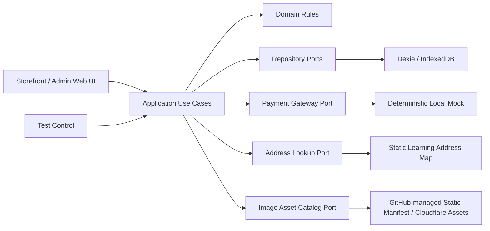
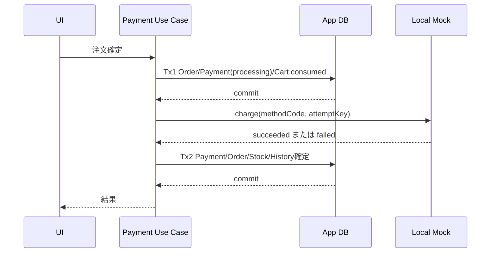

# システムアーキテクチャ

## 1. Phase 1全体構成

Phase 1はServer、API、Cloud Database、外部Paymentを持ちません。

## 2. レイヤー責務

### Presentation

- Storefront/Admin Shell、Route、画面状態、Form、Focus、表示Message
- Use Case呼出しと結果表示
- DB・価格計算・権限判断を直接持たない

### Application

- 認証、商品、Cart、Checkout、Payment、Order、Reviewの処理順序
- `ApplicationTransactionRunner`を使ったTransaction境界
- Role、Ownership、Versionの検証呼出し

### Domain

- Money、価格・送料・会員割引
- 商品閲覧条件、Search/Filter/Facet Rule
- 在庫・数量制約
- Order/Payment/Product/Reviewの状態遷移

### Infrastructure

- Dexie Repository、Admin Overview Read Model
- Local Session、GitHub管理の静的Image Asset Catalog
- Deterministic Mock Payment Gateway
- Static Address Lookup、System Clock/ID Generator

## 3. 主要Ports

- UserRepository、SessionRepository、AddressRepository、AddressLookupService
- StorefrontCatalogQueryRepository、ProductQueryRepository、AdminProductQueryRepository、ProductRepository、CategoryRepository、BrandRepository、ReviewSummaryRepository、ImageAssetCatalogRepository
- CartRepository、CheckoutSessionRepository
- InventoryRepository
- OrderRepository、SequenceRepository、ShipmentRepository
- PaymentRepository、PaymentGateway
- ReviewRepository、AdminOverviewQueryRepository
- Clock、IdGenerator、PasswordHasher
- ApplicationTransactionRunner、TestInspectionRepository

## 4. 状態管理

- 永続業務Data: Repository
- Current Session ID: Local Storage
- 画面内Form・Dialog: Component State
- 共有UI状態: 必要最小限のContext
- Server State Libraryは使用しない

## 5. 商品Aggregateと画像Asset境界

- 商品保存は`ProductAggregate`（Product、Variant、ProductImage関連）単位で行う。
- 既存Variantの`stockQuantity`はAggregate更新対象外とし、在庫調整Use Caseだけが変更する。
- ProductImageはGitHub Repository内の静的Assetを`assetId`で参照する。画像BinaryはIndexedDBへ保存しない。
- 管理UIはAsset Catalogから選択、関連解除、Primary変更、順序変更、Alt Text変更だけを行う。
- BrowserからGitHub APIへ書き込まず、画像Binary追加はCommit/PR、Manifest生成、Cloudflare再Deployで反映する。
- Release済みAssetはBrowser内の参照有無をGitHub CIから判定できないためappend-onlyとし、廃止は`isActive=false`で表す。
- 新規関連付けはactive Assetだけを許可し、既存関連のinactive Assetは維持・表示できるが、解除後の再関連付けはできない。

## 6. Phase 1 Payment境界

Paymentは外部決済の厳密な再現ではなく、E2Eで成功・失敗・再試行を学ぶための決定的Mockです。

- Gateway呼出し中にDB Txを保持しません。
- Mock結果はMethod Codeだけで決まり、同じAttempt Keyは同じ結果になります。Mockは時刻を返さず、結果受領後にApplicationが`Clock.now()`を1回取得し、Payment processedAt・Order/Payment HistoryのcreatedAtへ同じ値を使用します。
- `processing`のまま再起動した場合や確定Txが失敗した場合、同じAttemptを再実行します。Local Mockなので二重課金概念はありません。既にsucceeded/failedなら既存結果を返し、確定競合時は最新状態を再取得して完了済み結果を返します。
- timeout、unknown、独立台帳、ReconciliationはPhase 3です。

## 7. Transaction実装契約

- Application層は`ApplicationTransactionRunner.run(scope, work)`を呼び、Runnerが必要なDexie Storeを1つのTransactionとして開く。
- `work`へ渡すRepository群は同じTransaction Contextへ束縛され、Context外のRepositoryを混在させない。
- Gateway、Address LookupなどDB外I/OはTransactionの外で実行する。画像CatalogはBuild生成Moduleを静的importし、必要なPathをTransaction開始前に解決する。
- 複数Storeをまたぐ書込みは`ApplicationTransactionRunner`から開始し、参加Repositoryはtop-level Transactionを開始しない。
- 単一Storeで完結する単純作成・更新はRepository Method内の1 Transactionを許可する。
- Category作成は単一Category Store Transaction内で現在の最大sortOrderを読み、0件なら10、既存時はmax+10として保存する。
- Login/Register、Cart統合、Checkout、Product Aggregate/Status、Inventory、User Access、Order、Payment、Shipment、ReviewのScopeを型付きMapで固定する。

## 8. 主なTransaction

| 操作 | 同一Txで更新するData |
|---|---|
| Login/Register | Session、User作成（Register時）、Guest/User Cart統合 |
| Default配送先保存・削除（単一Store） | User Address、旧Default解除または後継Default |
| 初回Cart追加 | ownerのactive Cart取得または作成、Cart Item加算/作成、親Cart version更新 |
| Cart変更 | Cart、Cart Item、親Cart version |
| 商品Aggregate・公開状態 | Category/Brand、Product、Variant、Image関連、INITIAL_STOCK History |
| 商品Aggregate時刻 | Use CaseがClockを1回取得し、Product・Variant・画像関連・INITIAL_STOCK履歴へ同じ時刻を使用。Create時だけ0件Review Summaryにも使用し、Update時はSummaryを変更しない |
| Category/Brand無効化 | CategoryまたはBrand、参照Product |
| 在庫調整 | Variant在庫、Inventory History |
| User Access | User、対象User Sessions。customer停止時はactive Checkoutもabandoned |
| Order作成 | Order、Order Items（Build生成Catalogから事前解決した画像Pathと、Tx内ProductImageから取得したAlt TextのSnapshotを含む）、Payment processing、Cart consumed、Checkout converted、Sequence、History |
| Payment成功確定 | Payment succeeded、Order paid、SKU在庫、Inventory History、Order History |
| Payment失敗確定 | Payment failed、Order payment_failed、Order History |
| Payment再試行 | Order pending_payment、新Payment processing、Order History |
| 発送 | Order shipped、Shipment shipped、Order History |
| 配送完了 | Order delivered、Shipment delivered、Order History |
| Review変更 | Review、Review History、Product Review Summary・評価分布 |

## 9. Platform分離

Phase 1はDexieだけを実装します。Repository InterfaceはPlatform非依存に保ち、Phase 2でSQLite Adapterを同じContract Testへ追加します。WebとNativeを同時完成させるための抽象化は行いません。

## 10. Error境界

- Domain Error: Validation、Permission、Invalid State、Stock、Price
- Repository Error: Read、Write、Conflict、Quota
- Presentation: 利用者向けMessageへ変換
- 内部Exception、Stack、Password、住所全文を画面へ出さない

## 11. Clock・ID・Test Control

Clock、ID Generator、PasswordHasherはPort化します。Automation BuildではClock固定、Seed Reset、Payment Delay、固定Read-only Inspectionだけを提供します。任意DB書換え、任意Table Query、任意Script実行は提供しません。

## 12. Web配信

Expo Web SPAをCloudflare Pages 1 Projectへ配信します。Bot Challenge、Turnstile、Accessは自動化対象で使用しません。

## 13. 禁止事項

- UIからDexieを直接呼ぶ
- 複数Repository更新を別々のTransactionとして順番にCommitする
- BrowserへGitHub Tokenを埋め込み、管理UIから画像BinaryをGitHubへUploadする
- Payment Mock呼出し中にDB Txを保持する
- 未使用のGateway Ledger、Refund、Migration Recovery TableをPhase 1へ作る
- StorefrontとAdminを同じPage Shellへ詰め込む
- Domain内部状態名をUIへ直接表示する
- Role判定をメニュー非表示だけで済ませる
- 固定sleepをE2Eの同期手段にする

## 実装境界と採用ライブラリ

- Presentationは`*Request`のみ生成し、ApplicationがSession、Clock、IdGenerator、GuestIdentity、Build生成Manifestから`*Command`を組み立てる。
- FormはReact Hook Form、ValidationはZod。
- Shared UIはReact Native StyleSheet、Web専用Admin/Layoutは`.web.tsx`＋CSS Modules。
- Dialog/Combobox等はReact Aria Componentsへ限定する。
- 実装開始後は`src/domain/contracts`、`src/application/contracts`、`src/application/errors.ts`、Dexie Schema実コードを型の正本とし、Markdownは意味・業務ルール・設計理由を正本とする。
