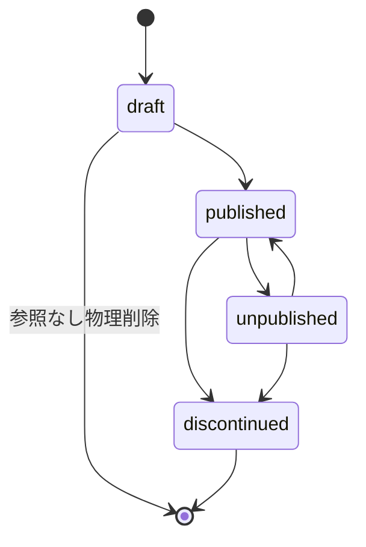
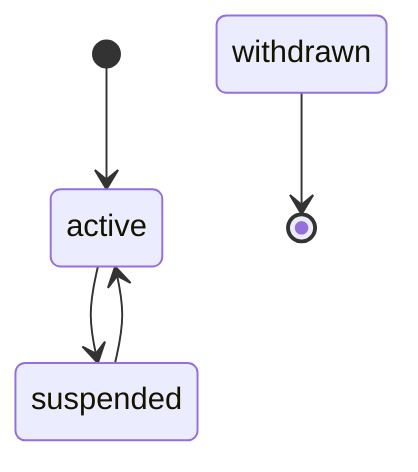
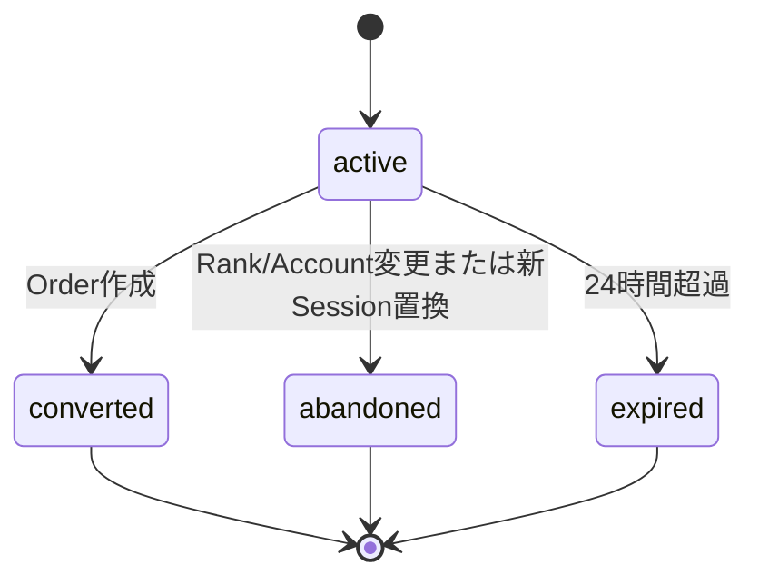
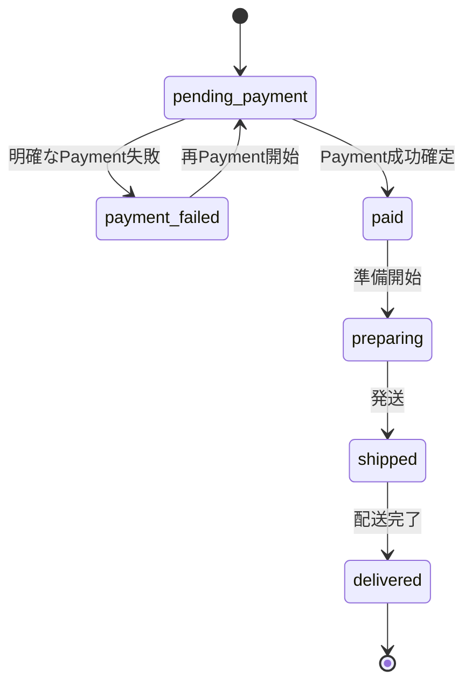
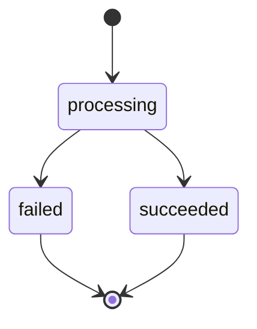
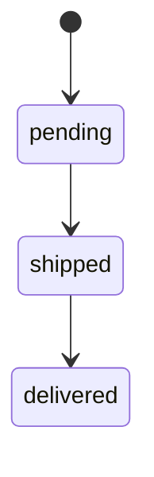
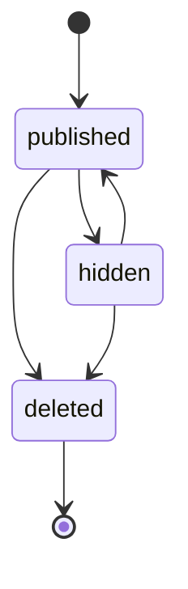
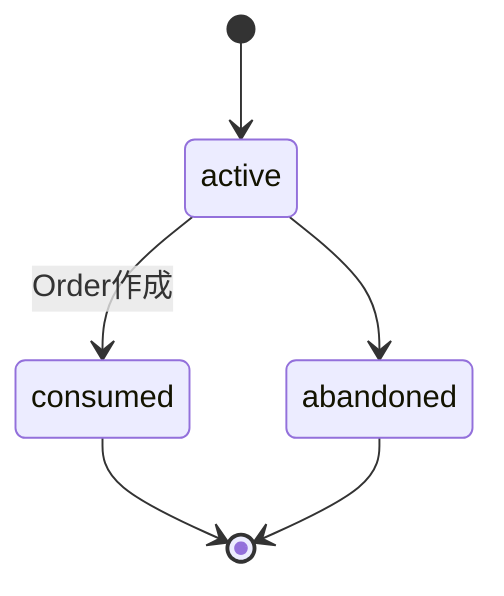

# 状態遷移設計

## 1. Phase 1

### 商品

### Account

Phase 1では`active ↔ suspended`だけを管理操作として扱います。`withdrawn`は固定Seedの読取専用状態で、退会遷移はPhase 2です。

### Checkout Session

Cart変更時はCheckout Sessionを同じTransactionで更新しません。Cart Item変更で親Cart Versionだけを更新し、Checkout Route Guard・確認画面取得・注文確定時にSessionの`cartVersion`との不一致を検出してCartへ戻します。その後にCheckoutを再開始した際、旧active Sessionをabandonedへ変更して新しいCart VersionのSessionを作成します。

### Order

### Payment

### Shipment

### Review

### Cart

## 2. 操作制約

- Payment processing中は再Payment・Cancel不可。
- paid Orderを直接shippedへ変更できない。必ずpreparingを経由する。
- OrderとShipmentの状態を別々の操作で更新しない。
- Review deletedは終端。
- 強制状態変更Use CaseはPhase 1へ設けない。

## 3. 将来拡張

- Phase 2: cancelled、cancel_requested、return_requested、returned、refund_pending、refund_failed、refunded。
- Phase 3: payment_unknown、reconciliation_required。

将来状態をPhase 1のDB CHECK制約やUIへ先行追加しません。
