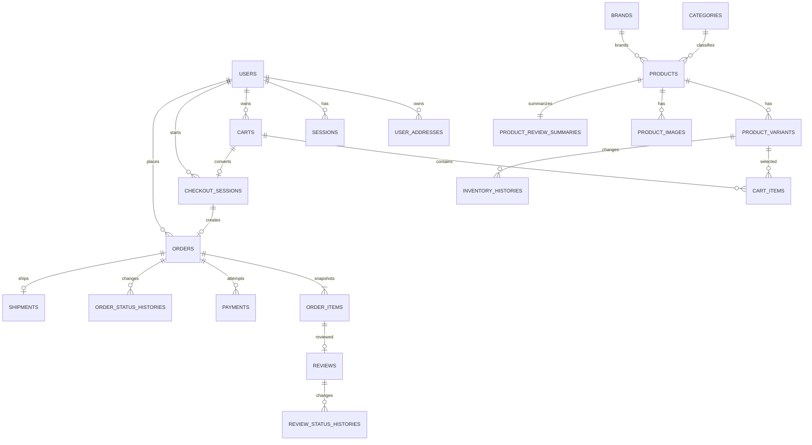

# データモデル

## 1. Phase 1 ER図

## 2. 共通規約

- IDはUUID文字列。Seedだけ可読固定IDを使用する。
- 日時はUTC ISO 8601文字列で保存し、表示時にAsia/Tokyoへ変換する。
- 金額・数量・在庫は整数。
- 更新対象に`version`を持たせ、更新時に一致を確認する。
- Phase 1で未使用の将来EntityはTable化しない。

## 3. User・Session

### users

| Field | Rule |
|---|---|
| id | PK |
| email | unique、lowercase |
| passwordHash | `application_contracts.md`のPBKDF2形式。平文不可 |
| displayName | 1～100文字 |
| phone | nullable、Dummyのみ |
| role | customer/operator/admin |
| membershipRank | customerはregular/gold/platinum、管理Roleはnull |
| accountStatus | active/suspended/withdrawn |
| createdAt/updatedAt | UTC |
| version | 楽観Lock |

### user_addresses

id、userId、label、recipientName、postalCode、prefecture、city、addressLine1、addressLine2、phone、isDefault、createdAt、updatedAt、version。Userあたり最大5件、defaultは最大1件。最初の住所は自動Default、Default更新で単に指定を外す操作は不可、Default削除時はcreatedAt昇順・id昇順の後継を選びます。Web Persistence RecordはIndex用に`isDefaultKey: 0 | 1`を派生保持します。

### sessions

id、userId、createdAt。Current Session IDだけLocal Storageへ保存します。

## 4. 商品Master

### categories

id、name、nameNormalized unique、sortOrder、isActive、createdAt、updatedAt、version。Phase 1は1階層Categoryだけを扱い、商品は1つのCategoryを直接参照します。新規作成時は0件ならsortOrder=10、既存時はmax(sortOrder)+10として末尾へ追加します。公開商品が参照するCategoryは無効化できません。Web Recordは`isActiveKey: 0 | 1`を派生保持します。

### brands

id、name、nameNormalized unique、isActive、createdAt、updatedAt、version。Brandの表示順は`nameNormalized`昇順、同値id昇順で固定し、手動並べ替えは行いません。Web Recordは`isActiveKey: 0 | 1`を派生保持します。

### products

id、productCode unique、name、shortDescription、description、categoryId、brandId、status、requiredRank nullable、variationName nullable、publishedAt nullable、createdAt、updatedAt、version。`publishedAt`は初回公開時に設定し、非公開・再公開では保持する。新着順は`publishedAt`降順、同値はproductCode昇順とする。

### product_variants

id、productId、sku unique、optionValue nullable、optionValueNormalized nullable、regularPrice、salePrice nullable、saleStartAt nullable、saleEndAt nullable、stockQuantity、purchaseLimit、isActive、createdAt、updatedAt、version。draftを含むProductはactive Variantを1件以上持ち、Variationなしはactive Variantちょうど1件、Variationありは1件以上とします。既存VariantのstockQuantityは商品Aggregate更新対象外。Web Recordは`isActiveKey: 0 | 1`と、activeかつVariationなしを`__SINGLE_ACTIVE__`、inactiveを`__INACTIVE__:<variantId>`とする`optionScopeKey`を派生保持します。

### product_images

id、productId、assetId、altText、sortOrder、isPrimary、createdAt。`assetId`はGitHub管理の静的Manifestを参照し、Productあたり最大3件。同一Product内のassetIdとsortOrderは一意。画像0件はdraftだけ許可し、画像1件以上ならPrimaryをちょうど1件持つ。BinaryはDBへ保存しない。

### image_asset_catalog（Build生成TypeScript Module、DB Tableではない）

`assetId` unique、path、mimeType、width、height、bytes、sha256、defaultAltText、tags、isActive。GitHub Repository内の画像からBuild時にTypeScript Moduleを生成してBundleへ含めます。画像BinaryはCloudflareから同一Originで配信し、既存商品参照中のAssetは`isActive=false`でも表示可能です。

### ProductListItem（Read DTO）

productId、productCode、name、brandName、primaryImage、minimumViewerUnitPrice、maximumViewerUnitPrice、hasPurchasableStock、hasActiveSale、ratingAverage、publishedReviewCountを持ちます。DB TableではなくSearch Queryで生成します。

管理商品一覧Read DTOはactive SKUの在庫合計`activeTotalStock`を返し、商品単位の在庫Filterを`0=out_of_stock`、`1～5=low_stock`、`1以上=in_stock`で判定します。

### product_review_summaries

productId PK、publishedCount、ratingTotal、ratingAverage、rating1Count、rating2Count、rating3Count、rating4Count、rating5Count、updatedAt、version。各Countは0以上で、合計がpublishedCountと一致する。`publishedCount=0`では`ratingAverage=0`、それ以外は`ratingTotal / publishedCount`を丸めず保存し、表示時だけ小数第1位へ丸める。Sort・Filterも未丸め値を使用する。

## 5. 在庫

### inventory_histories

id、variantId、changeQuantity、beforeQuantity、afterQuantity、reasonCode、reasonText、actorUserId nullable、orderId nullable、createdAt。

## 6. Cart・Checkout

### carts

id、ownerType guest/user、guestId nullable、userId nullable、status active/consumed/abandoned、createdAt、updatedAt、version。

- activeなUser CartはUserごとに1件。
- activeなGuest CartはguestIdごとに1件。guestIdはLocal Storageに保存する。
- Cart Itemが変更されるすべての操作で、親CartのupdatedAtとversionも同一Txで更新する。

### cart_items

id、cartId、variantId、quantity、unitEffectivePriceAtAdd、createdAt、updatedAt、version。同一Cart・Variantは1件。保存値はSale適用後・会員割引適用前の単価であり、会員割引はCart表示時と注文確定時に現在のランクから再計算します。

### CartLineDto（Read DTO）

商品名、SKU、Variation、画像、数量、購入可能上限、追加時単価、現在の割引前有効単価、現在の会員価格、行金額、問題Codeを保持します。DB TableではなくCart Queryで生成します。

### checkout_sessions

| Field | Rule |
|---|---|
| id | PK |
| userId/cartId | customerとactive Cart |
| cartVersion | Checkout開始時 |
| addressSnapshot | Address決定後にTyped Objectで保存 |
| paymentMethodCode | Test Code、未選択はnull |
| unlockedStep | address/payment/confirm。到達済みの最も後ろの段階を表し、戻る操作では減らさない |
| status | active/converted/abandoned/expired |
| expiresAt | 作成から24時間 |
| orderId | converted後だけ設定 |
| createdAt/updatedAt/version | 共通 |

Userごとのactive Checkout Sessionは最大1件とします。

Gateway KeyはCheckout Sessionへ保存しません。

## 7. Order・Payment・Shipment

### orders

id、orderNumber unique、userId、checkoutSessionId unique、status、subtotalAmount、discountAmount、shippingAmount、totalAmount、membershipRankSnapshot、shippingAddressSnapshot、createdAt、updatedAt、version。

Phase 1 status: pending_payment、payment_failed、paid、preparing、shipped、delivered。

### order_items

id、orderId、lineNumber、productId、variantId、productCodeSnapshot、productNameSnapshot、skuSnapshot、variationNameSnapshot nullable、optionValueSnapshot nullable、unitEffectivePrice（Sale適用後・会員割引前）、unitDiscountAmount、quantity、lineSubtotalAmount、lineDiscountAmount、lineTotalAmount、primaryImageAssetIdSnapshot、primaryImagePathSnapshot、primaryImageAltTextSnapshot、createdAt。同一Order内のlineNumberは1始まりで一意とし、Cart ItemのcreatedAt昇順・同値itemId昇順で採番します。`unitDiscountAmount=floor(unitEffectivePrice×ランク割引率)`、`lineDiscountAmount=unitDiscountAmount×quantity`、`lineTotalAmount=lineSubtotalAmount-lineDiscountAmount`とします。Order.discountAmountは全明細lineDiscountAmountの合計と一致させます。代表画像はlineNumber=1を使用します。商品画像関連が後から変わっても注文履歴はSnapshot Pathを表示します。

### daily_sequences

sequenceType、localDateを複合PKとし、currentValue、versionを保持します。

### order_status_histories

id、orderId、fromStatus nullable、toStatus、actorUserId nullable、reasonCode、createdAt。

### payments

| Field | Rule |
|---|---|
| id | PK |
| orderId | FK |
| attemptNumber | Order内1始まり |
| methodCode | TEST-SUCCESS等 |
| status | processing/succeeded/failed |
| amount | Order totalと一致 |
| gatewayIdempotencyKey | unique、Attempt作成時に生成 |
| errorCode | failed時 |
| createdAt/processedAt | UTC。processedAtはGateway結果受領後のApplication Clockを正本とする |
| version | 楽観Lock |

`orderId + attemptNumber`をuniqueとします。

### shipments

id、orderId unique、status pending/shipped/delivered、carrierName nullable、trackingNumber nullable、shippedAt nullable、deliveredAt nullable、createdAt、updatedAt、version。

## 8. Review

### reviews

id、orderItemId unique、productId、userId、rating、title nullable、body、status published/hidden/deleted、createdAt、updatedAt、version。

### review_status_histories

id、reviewId、fromStatus nullable、toStatus、actorUserId、reasonText nullable、createdAt。初回Review作成時だけfromStatusはnullです。

## 9. Settings

### app_settings

key PK、valueJson、updatedAt。Test Clock、Payment Delay、Seed Version等を保存します。

### schema_metadata

key PK、value、updatedAt。Phase 1ではSchema VersionとSeed Versionの確認に使用します。

## 10. 正本関係

| 情報 | 正本 |
|---|---|
| 商品の現在価格・在庫 | product_variants |
| 注文時点の商品・価格・住所 | order_items / orders Snapshot |
| 注文業務状態 | orders.status |
| Payment Attempt状態 | payments.status |
| 配送状態 | shipments.status |
| 商品Review集計 | product_review_summaries |
| Checkout進捗 | checkout_sessions |
| 商品画像BinaryとPath | GitHub Repository / static image manifest |
| 商品と画像の関連・順序・Alt | product_images |

## 11. 将来Entity

Phase 2: order_requests、refunds、audit_logs。Phase 3: gateway_transactions、legal_acceptances、Import/Export Metadata。Phase開始前に項目と制約を再レビューします。
