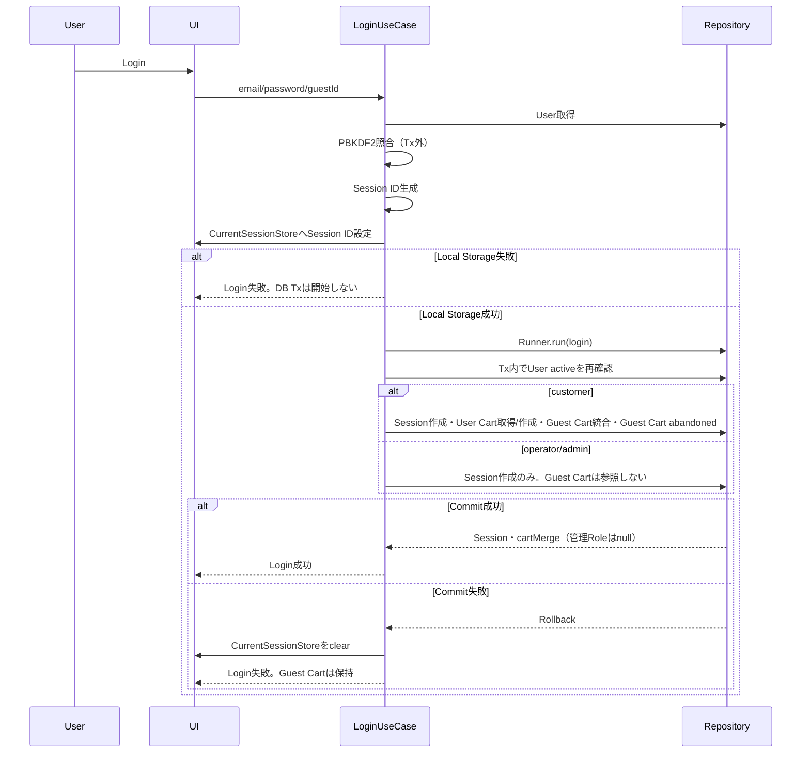
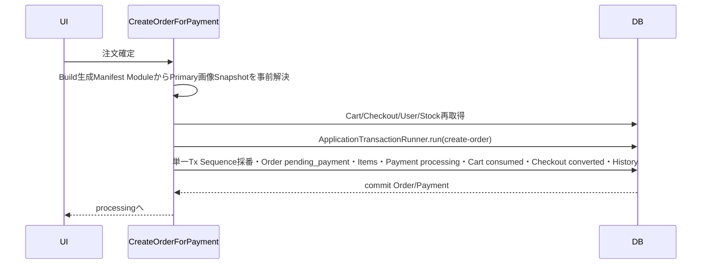
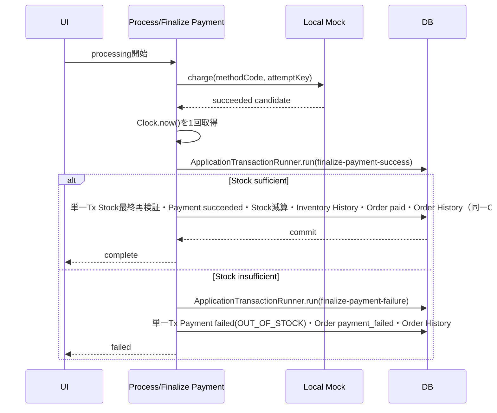
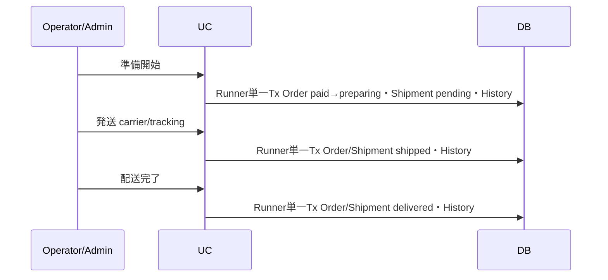
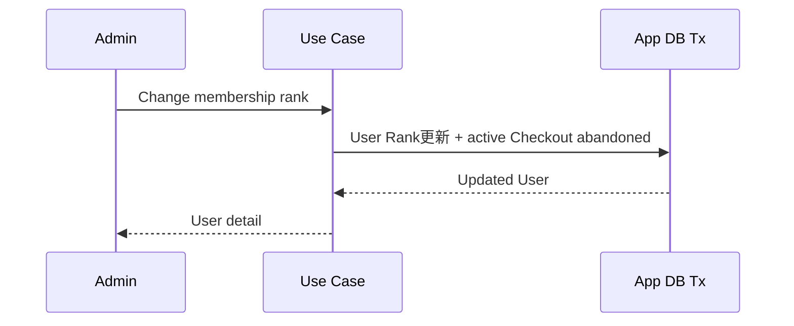

# Sequence Flow

## 1. LoginとGuest Cart統合

## 1.1 Cart変更

1. guest/customerとactive Cart、Cart expectedVersionを確認する。
2. Addは追加数量、Updateは変更後絶対数量としてSKU、在庫、購入上限を検証する。Update数量0はRemoveへ委譲する。
3. Addは既存SKUへ加算または新規IDで作成し、Updateは絶対数量へ置換する。変更・削除・価格変更承認と親CartのupdatedAt/version更新を同一Txで確定する。
4. 既存Checkout SessionはこのTransactionで更新しない。親Cart Versionの変更を、Checkout Route Guard・確認画面取得・注文確定時の不一致検出に使用する。
5. 競合時はItemもCartも変更せずConflictを返す。

## 2. Checkout開始

1. Clockで期限切れactive Checkout Sessionをexpiredへ変更する。
2. active customerとactive Cartを確認する。
3. 商品公開、Rank、価格、在庫を再検証する。
4. 価格変更未承認ならCartへ戻す。
5. Userのactive Checkout Sessionを確認する。
6. 同じCart ID/Versionなら再開し、異なる場合は既存をabandonedへ変更する。
7. 必要ならCheckout Sessionをactive/addressで作成する。
8. Address、Payment、Confirmへ順に進む。

## 2.1 商品Aggregate保存

1. operator/adminとProduct expectedVersionを確認し、Use CaseがClockを1回取得する。
2. Product、Variant、画像関連を検証する。
3. 既存VariantのstockQuantityが入力で変更されていないことを確認する。
4. 新規VariantのinitialStockQuantityからINITIAL_STOCK履歴を作成する。
5. 削除指定Variantの参照を確認し、物理削除または無効化を決定する。
6. Image Asset ManifestでassetIdを検証する。
7. Product、Variant、ProductImage関連、必要なInventory Historyを同一Txで保存し、手順1で取得した同一時刻を各createdAt/updatedAtへ使用する。新規商品では0件Review Summaryも同一Tx・同一時刻で作成する。商品更新では既存Review Summaryを読み書きしない。既存inactive Asset関連は維持可能だが、新規関連付け・再関連付けはactive Assetだけとする。

GitHub画像BinaryはこのSequenceでは変更しません。

## 3. Order作成

Payment GatewayはこのTx内で呼びません。画像PathはBuild生成ModuleからTransaction前に解決します。Transaction内ではPrimary assetIdと事前解決したPathを照合し、商品固有Alt Textは現在のProductImage関係から取得してOrder Itemへ保存します。

Order作成Tx内で、Cart Itemの追加時単価と現在時刻に基づく現在単価を再計算して比較します。差異があれば`PRICE_CHANGED`として全体をRollbackし、Cart/Checkoutへ再確認を要求します。

## 4. Payment成功

## 5. Payment明確失敗と再試行

- Mockがfailedを返した場合、Payment failed、Order payment_failedを同一Txで確定する。
- 在庫は変更しない。
- Order詳細から再試行すると、`retry-payment`単一TxでOrderをpending_paymentへ戻し、HistoryとattemptNumberを増やしたPayment processingを作る。
- 新AttemptのgatewayIdempotencyKeyを生成する。
- processing中は再試行・Cancelを表示しない。

## 6. processing再開

`/checkout/processing?orderId=...`の表示時、App/Browser再起動後、またはPayment結果確定のDB書込みが失敗して最新Paymentがprocessingのまま残った場合、Order所有権、Order pending_payment、最新Payment processingを確認して`ResumeProcessingPaymentUseCase`を実行します。同じAttempt KeyとMethod CodeでLocal Mockを再実行し、成功または失敗へ確定します。

## 7. Order処理

## 8. Review

1. customer本人、Order delivered、Order Item未Reviewを確認。
2. Reviewをpublishedで作成。
3. Product Review Summaryの件数、合計、平均、評価1～5別件数を同一Txで更新。
4. 非公開・再公開・編集・削除でもSummaryと評価分布を同時更新。

## 9. 在庫調整

1. operator/admin、Variant expectedVersion、調整理由を確認する。
2. `ApplicationTransactionRunner.run("adjust-inventory")`を開始する。
3. Variant在庫を更新し、before/after/changeを持つInventory Historyを同じTxで作成する。
4. 在庫不足、競合、履歴保存失敗時は全体をRollbackする。

## 10. User Access変更

1. admin本人と対象Userを取得する。
2. Rank変更はcustomer内、Role変更はoperator/admin間、Status変更はactive/suspended間だけ許可する。
3. Role/Status変更では同一Tx内で最後のactive adminと自己変更を再検証する。
4. User更新と対象Userの全Session削除を同一TxでCommitする。
5. CartとOrderは変更しない。会員ランク変更、またはcustomerをsuspendedへ変更する場合は、対象Userのactive Checkoutを同一Txでabandonedへ変更する。

## 11. Checkout期限切れ

App起動、Checkout Route Guard、StartCheckout開始時にClockと`expiresAt`を比較し、期限超過のactive Sessionをexpiredへ変更します。定期Timerは使用しません。

## 12. Test Reset

Test ControlまたはTest API → 同一Browser ContextにPageが1件だけであることを確認 → Dexie Connection Close → IndexedDB削除 → CurrentSessionStore削除 → GuestIdentityStore削除 → DB v1作成 → 指定Seed投入 → Seed Guest ID設定 → Metadata返却 → Page Reload。別PageまたはDB delete blocked時は`RESET_BLOCKED_BY_OPEN_PAGE`で失敗し、成功扱いしません。

## 会員ランク変更

Cartは保持し、customerは次回Checkout開始時に新ランクで金額を再確認します。

## Payment再開の冪等性

最新Attemptが完了済みなら既存結果を返します。processingなら同じAttempt KeyでLocal Mockを再実行し、確定TxのConflict後は最新Order/Paymentを再取得して、他処理で完了済みなら同じ結果画面へ遷移します。
