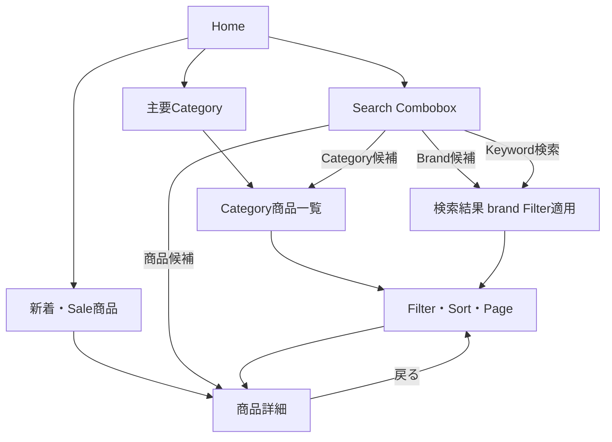
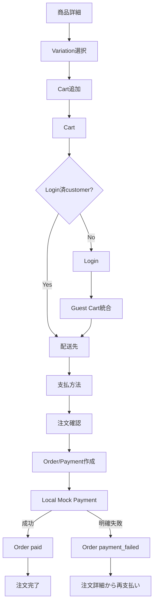
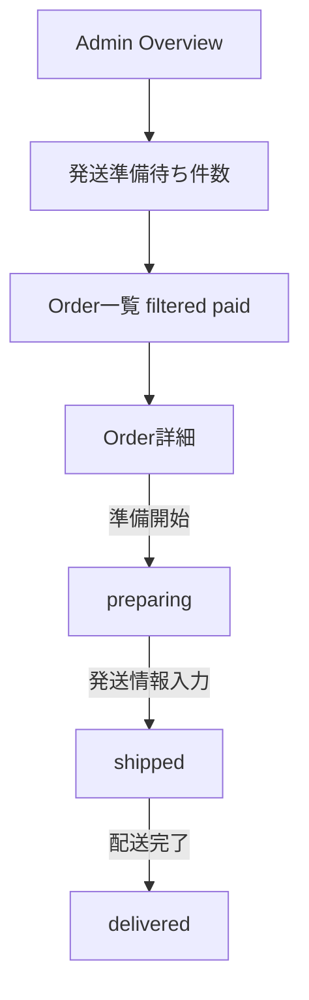
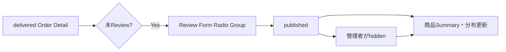

# User Flow

## 1. 商品探索Flow

検索候補の遷移は、商品候補を`/products/[productId]`、Category候補を`/categories/[categoryId]`、Brand候補を`/search?brand=[brandId]`、候補を選ばないEnter検索を`/search?q=[正規化済み入力]`とする。

検索結果へ戻った場合はQuery、Page、Scroll位置を復元します。

## 2. 購入Flow

### 2.1 商品詳細からの初回Cart追加

1. guestまたはcustomerがVariationと追加数量を選択する。
2. UIはvariantIdとaddQuantityだけを送る。
3. Use CaseがSessionまたはGuest Identityからownerを解決する。
4. Repositoryが同一Transactionでactive Cartを取得し、存在しなければ作成する。
5. 同じSKUの明細があれば数量を加算し、なければ新規明細を作成する。
6. 在庫・購入上限・99を検証し、親CartのupdatedAt/versionを更新する。
7. 成功後のCart DTOを返す。

## 2.2 Cart変更・統合Flow

- 追加・数量変更で上限を超えた場合は自動補正せず、元の数量を維持する。
- 数量0または削除Buttonで明細を削除する。
- Login時は会員Cartを基準にGuest Cartを統合し、追加数量、上限超過数量、除外明細をSKU単位で表示する。
- Guest Cartは統合Transactionでabandonedへ変更する。
- Cart Item変更時は親Cart versionだけを同一Transactionで更新し、進行中Checkout Sessionはその場で変更しない。Route Guard・確認・注文確定で不一致を検出してCartへ戻し、次回Checkout開始時に旧Sessionをabandonedへ変更する。

## 3. 管理Overview・Order Flow

## 4. Review Flow

## 5. 商品管理Flow

Admin Overviewまたは商品一覧 → 新規登録/編集 → 商品本体入力 → SKU追加/変更/無効化 → GitHub画像Asset選択/関連解除/並べ替え → 編集画面内Dialogで未保存Preview → Contextual Save BarでAggregate保存 → 公開条件確認 → Publish。

- 新規SKUは初期在庫を入力し、保存時にINITIAL_STOCK履歴を作る。
- 既存SKU在庫は商品Formで変更せず、在庫調整画面へ移動する。
- draftかつ参照なしの場合だけDanger Zoneから商品Aggregateを物理削除する。
- 新規画像Binaryはアプリ外でGitHubへCommitし、再Deploy後にAsset Catalogから選択する。

## 5.1 管理者登録商品を消費者が購入するFlow

1. adminが商品一覧からdraft商品を新規登録する。
2. Product Code、商品情報、SKU、初期在庫、GitHub画像Assetを設定し保存する。
3. 編集画面内Preview Dialogで未保存内容を確認し、公開条件を満たしてpublishedへ変更する。
4. adminがLogoutし、同じBrowser ContextでcustomerがLoginする。
5. customerが検索またはCategoryから商品を見つけ、SKUをCartへ追加する。
6. customerが数量変更・削除・再追加を行い、Checkoutで購入する。
7. adminへ再Loginし、Orderをpreparing、shipped、deliveredへ進める。
8. customerへ再Loginし、Order詳細からReviewを投稿する。

このFlowはBackendなしで同じIndexedDBを共有する教材Scenarioです。別Browser Context・別端末とはDataを共有しません。

## 6. Category並べ替えFlow

Category一覧 → 並べ替えMode → Dragまたは上下移動Button → 未保存状態 → Save Barで保存。Keyboard利用者は上下Buttonだけで完了できます。Brandは名称順固定で、並べ替え機能を持ちません。

## 7. 在庫管理Flow

Overviewまたは在庫一覧 → SKU選択 → 調整量・理由入力 → 変更前後確認 → 保存 → Inventory History。

## 8. Test Flow

Scenario選択 → Reset → Clock/Delay設定 → 対象画面へ移動 → Test → Trace/Screenshot/Metadata保存。

## 9. 将来Flow

- Phase 2: Native、Cancel、Return、Refund、Guest Checkout再評価。
- Phase 3: Payment Unknown/Reconciliation、Recovery、Import/Export。
