# Admin Catalog

## Purpose / Scope

Operator/AdminがProduct Aggregate、Category、Brand、Image Asset、公開状態を管理する契約を定義します。

## Business Rules

### BR-ADMINCAT-001 — Productの公開可否と状態遷移を検証する

公開にはactive Category、active Brand、active SKU、Image、Primary Imageが必要です。Product Aggregate編集でStatusを変更せず、専用状態変更だけが遷移を行います。

### BR-ADMINCAT-002 — Product AggregateとAsset関連をTransactionで更新する

Product、Variant、Image関連、初期在庫履歴、Review Summaryを一貫して保存し、既存在庫とRelease済みAsset Binaryを商品編集で破壊しません。

## UI / Behavior Contract

Operator/Adminは未保存FormのPreviewを見られますが、PreviewはDBを書き込みません。Draftでのみ許可されるCode/SKU変更と、公開後の追加SKU/無効化の境界を説明します。

### SCREEN-ADMIN-DASHBOARD — Admin Dashboard

Screen Catalog: [Screen Catalog](../screen-catalog.md)

#### Functions

- Operator/Adminが管理対象の概要と主要管理導線を確認する。
- Desktop境界を満たさないViewportでは管理操作の代わりにWarningを表示する。

#### Important UI States

| State slug | Type | Audience / Role | Condition / Scenario | Expected UI | Visual requirement | Required platforms | Visual detail | Related Oracle |
|---|---|---|---|---|---|---|---|---|
| `default` | baseline | `operator, admin` | `default` | 管理概要とNavigationを表示する。 | `required` | `web-desktop, web-tablet` | `-` | `BR-ADMINCAT-001`, `AC-ADMINCAT-001` |
| `admin-mobile-warning` | responsive | `operator, admin` | `default` | 1024px未満では専用Warningを表示する。 | `required` | `web-mobile, web-small-mobile` | `-` | `BR-ADMINCAT-001`, `AC-ADMINCAT-001` |

#### Visual References

##### `default`

###### Web Desktop

[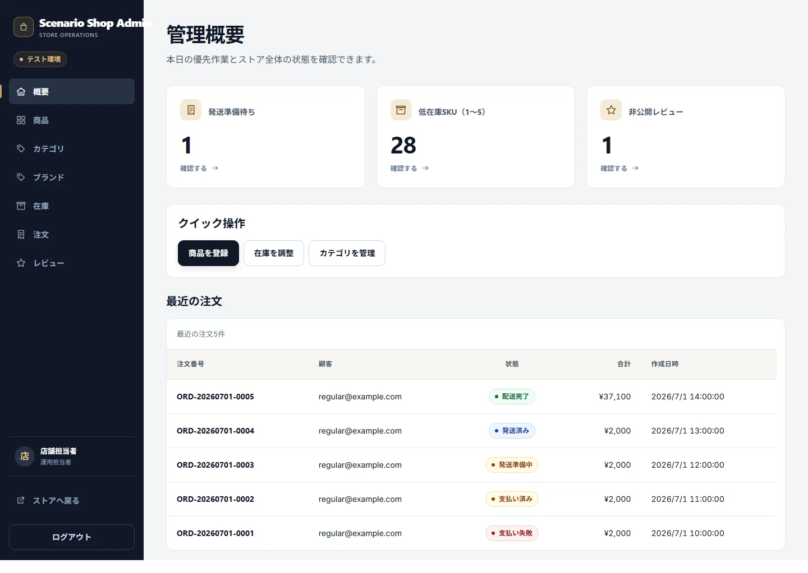](../assets/screens/SCREEN-ADMIN-DASHBOARD/default/web-desktop.webp)

###### Web Tablet

[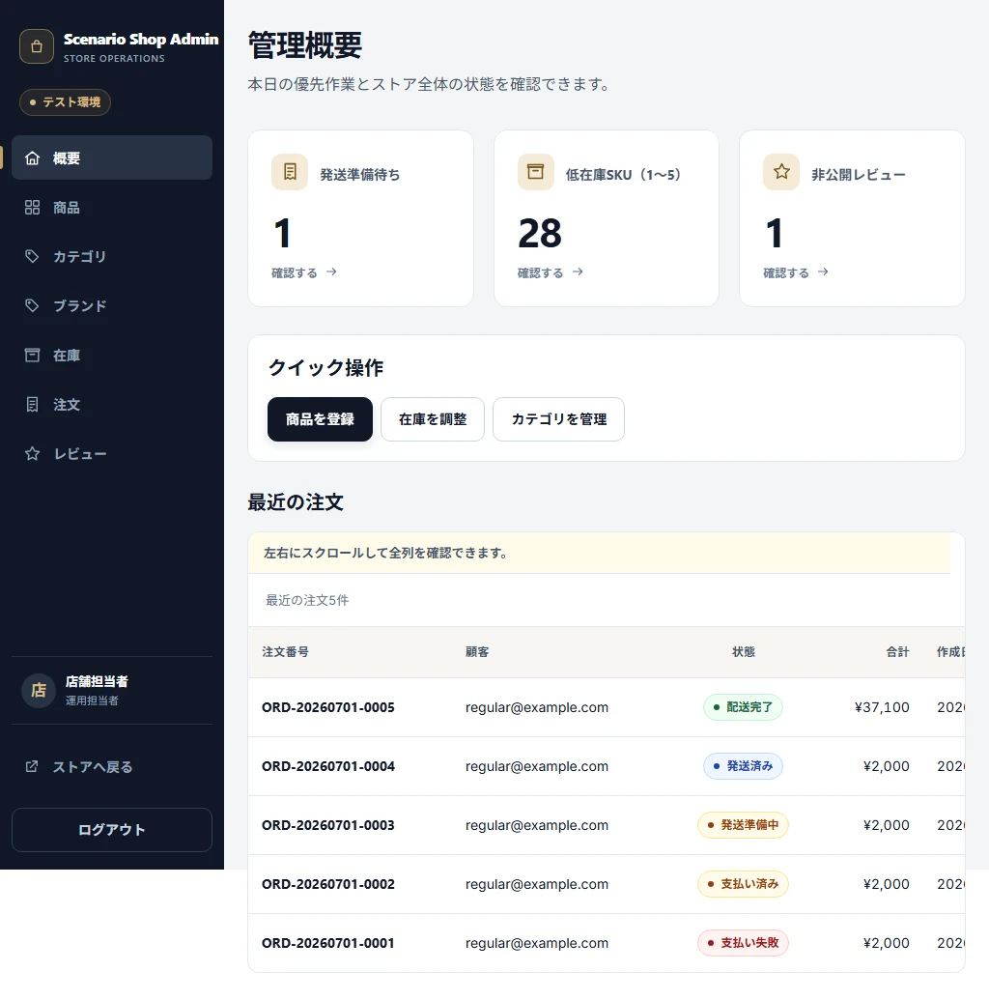](../assets/screens/SCREEN-ADMIN-DASHBOARD/default/web-tablet.webp)

##### `admin-mobile-warning`

###### Web Mobile

[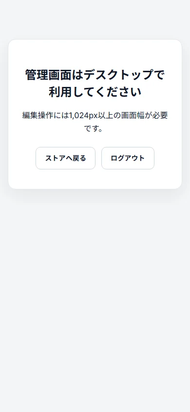](../assets/screens/SCREEN-ADMIN-DASHBOARD/admin-mobile-warning/web-mobile.webp)

###### Web Small Mobile

[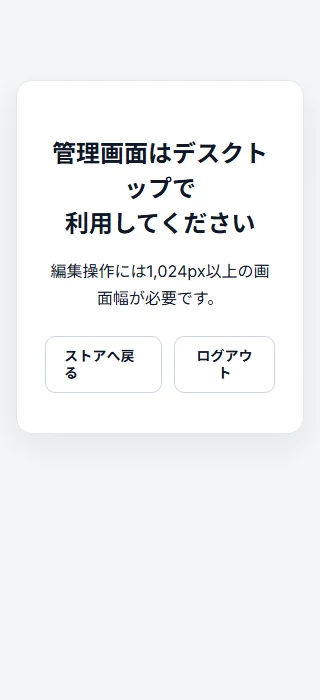](../assets/screens/SCREEN-ADMIN-DASHBOARD/admin-mobile-warning/web-small-mobile.webp)

### SCREEN-ADMIN-PRODUCTS — Admin Products

Screen Catalog: [Screen Catalog](../screen-catalog.md)

#### Functions

- Product、公開状態、Filter、Bulk操作の結果を表示する。
- Product New / Detailへの管理導線を提供する。

#### Important UI States

| State slug | Type | Audience / Role | Condition / Scenario | Expected UI | Visual requirement | Required platforms | Visual detail | Related Oracle |
|---|---|---|---|---|---|---|---|---|
| `default` | baseline | `operator, admin` | `default` | Product一覧と管理Actionを表示する。 | `required` | `web-desktop, web-tablet` | `-` | `BR-ADMINCAT-001`, `AC-ADMINCAT-001` |
| `many-products` | domain | `operator, admin` | `many-products` | 多数Productの一覧とFilterを表示する。 | `required` | `web-desktop` | `-` | `BR-ADMINCAT-001`, `AC-ADMINCAT-001` |

#### Visual References

##### `default`

###### Web Desktop

[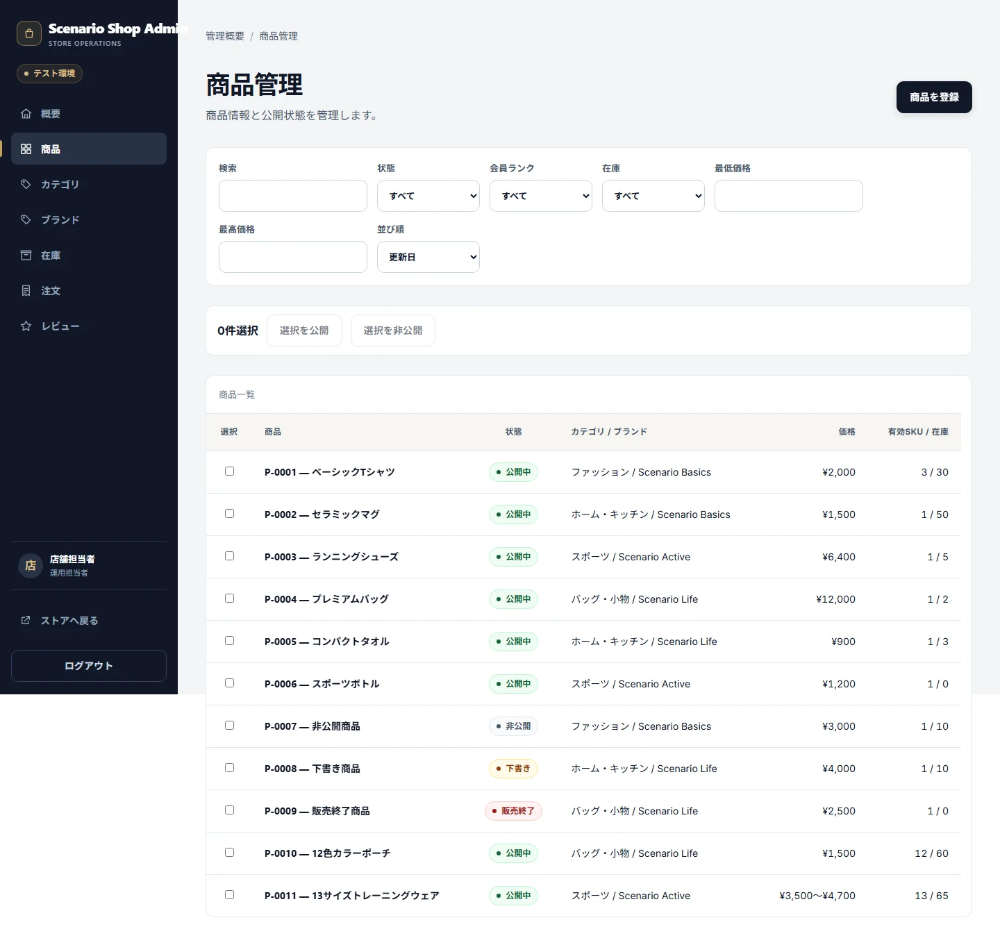](../assets/screens/SCREEN-ADMIN-PRODUCTS/default/web-desktop.webp)

###### Web Tablet

[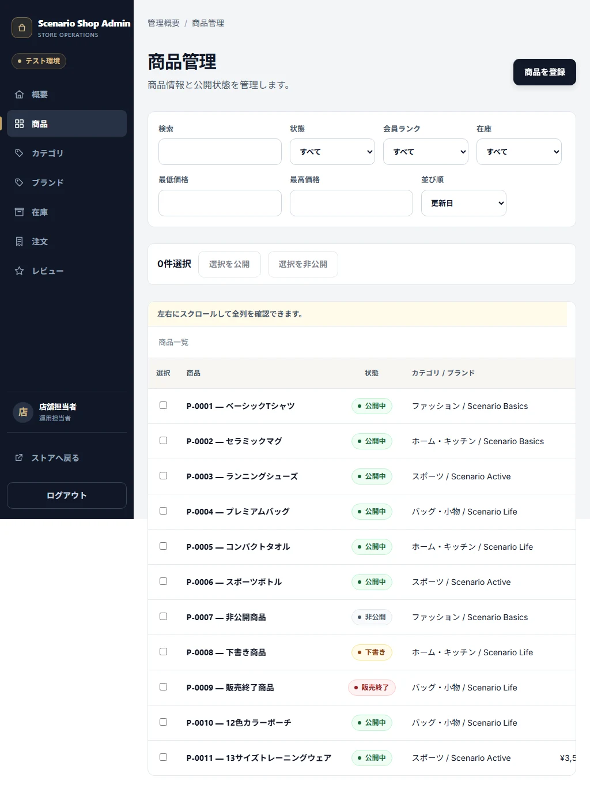](../assets/screens/SCREEN-ADMIN-PRODUCTS/default/web-tablet.webp)

##### `many-products`

###### Web Desktop

[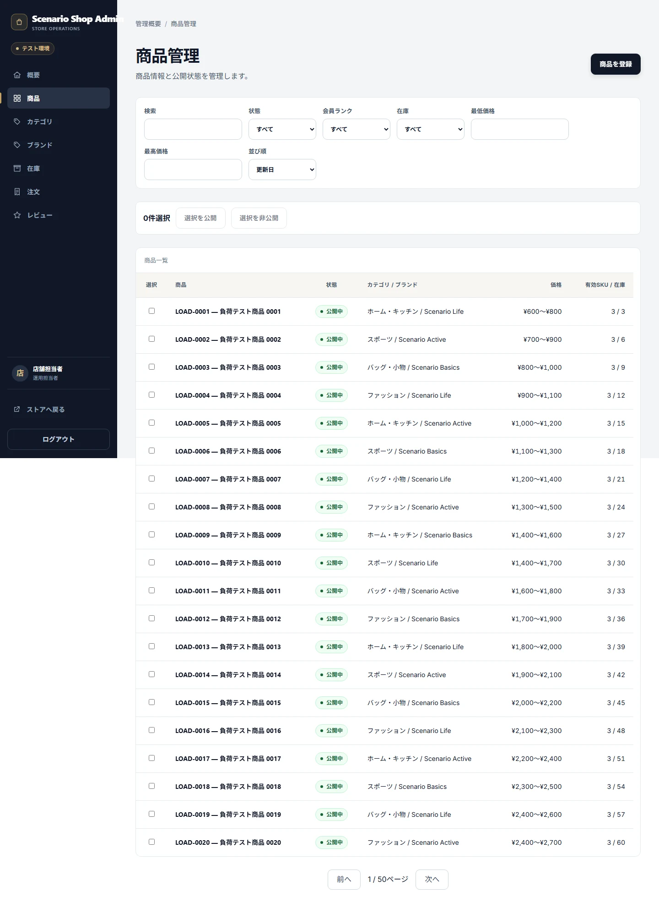](../assets/screens/SCREEN-ADMIN-PRODUCTS/many-products/web-desktop.webp)

### SCREEN-ADMIN-PRODUCT-NEW — Admin Product New

Screen Catalog: [Screen Catalog](../screen-catalog.md)

#### Functions

- Product Aggregateの新規入力、Validation、Previewを提供する。
- 保存前PreviewがDBへ書き込まれないことを表示上も区別する。

#### Important UI States

| State slug | Type | Audience / Role | Condition / Scenario | Expected UI | Visual requirement | Required platforms | Visual detail | Related Oracle |
|---|---|---|---|---|---|---|---|---|
| `default` | baseline | `operator, admin` | `default` | 新規Product Formを表示する。 | `required` | `web-desktop, web-tablet` | `-` | `BR-ADMINCAT-001`, `AC-ADMINCAT-001` |

#### Visual References

##### `default`

###### Web Desktop

[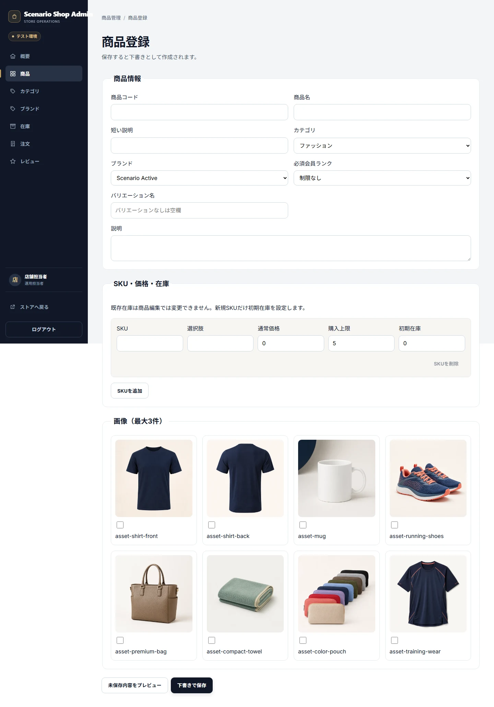](../assets/screens/SCREEN-ADMIN-PRODUCT-NEW/default/web-desktop.webp)

###### Web Tablet

[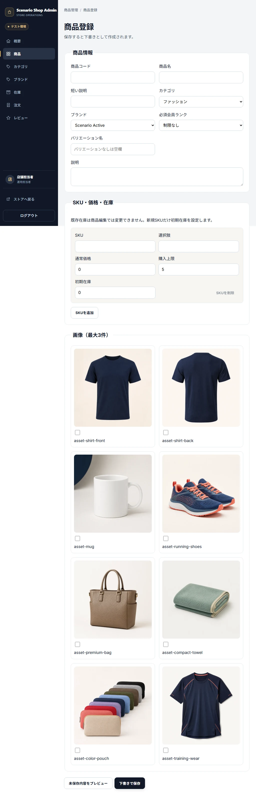](../assets/screens/SCREEN-ADMIN-PRODUCT-NEW/default/web-tablet.webp)

### SCREEN-ADMIN-PRODUCT-DETAIL — Admin Product Detail / Edit

Screen Catalog: [Screen Catalog](../screen-catalog.md)

#### Functions

- 既存ProductのAggregate、Variant、Image、在庫、公開状態を編集する。
- Dirty、Preview、Discontinue、Delete blockedなどの確認を表示する。

#### Important UI States

| State slug | Type | Audience / Role | Condition / Scenario | Expected UI | Visual requirement | Required platforms | Visual detail | Related Oracle |
|---|---|---|---|---|---|---|---|---|
| `default` | baseline | `operator, admin` | `default` | Product編集Formと現在状態を表示する。 | `required` | `web-desktop, web-tablet` | `-` | `BR-ADMINCAT-001`, `AC-ADMINCAT-001` |
| `discontinue-confirm` | conflict | `operator, admin` | `default` | 販売終了の確認Dialogを表示する。 | `required` | `web-desktop` | `-` | `BR-ADMINCAT-001`, `AC-ADMINCAT-001` |

#### Visual References

##### `default`

###### Web Desktop

[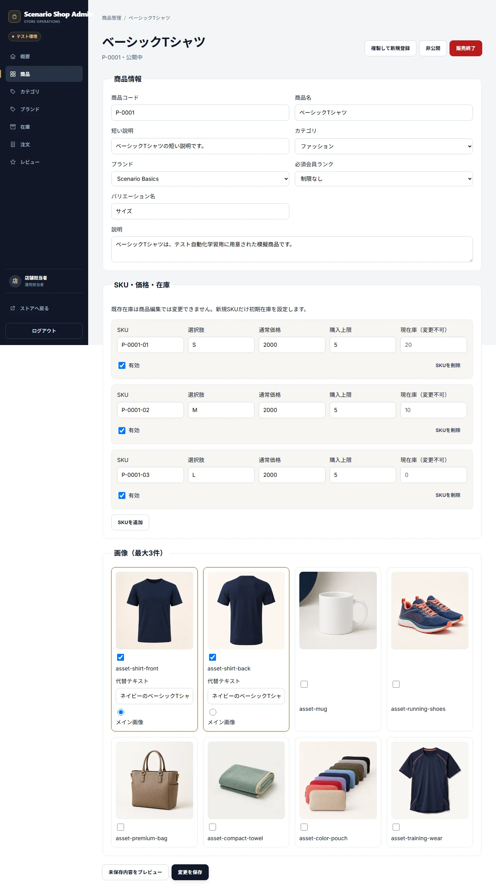](../assets/screens/SCREEN-ADMIN-PRODUCT-DETAIL/default/web-desktop.webp)

###### Web Tablet

[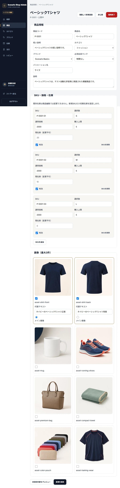](../assets/screens/SCREEN-ADMIN-PRODUCT-DETAIL/default/web-tablet.webp)

##### `discontinue-confirm`

###### Web Desktop

### SCREEN-ADMIN-CATEGORIES — Admin Categories

Screen Catalog: [Screen Catalog](../screen-catalog.md)

#### Functions

- Categoryの一覧、作成、編集、Validationを提供する。

#### Important UI States

| State slug | Type | Audience / Role | Condition / Scenario | Expected UI | Visual requirement | Required platforms | Visual detail | Related Oracle |
|---|---|---|---|---|---|---|---|---|
| `default` | baseline | `operator, admin` | `default` | Category一覧と管理Formを表示する。 | `required` | `web-desktop, web-tablet` | `-` | `BR-ADMINCAT-002`, `AC-ADMINCAT-002` |

#### Visual References

##### `default`

###### Web Desktop

[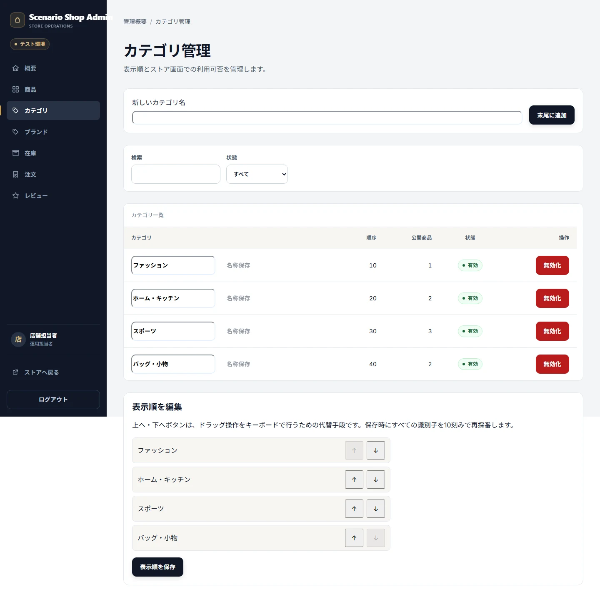](../assets/screens/SCREEN-ADMIN-CATEGORIES/default/web-desktop.webp)

###### Web Tablet

[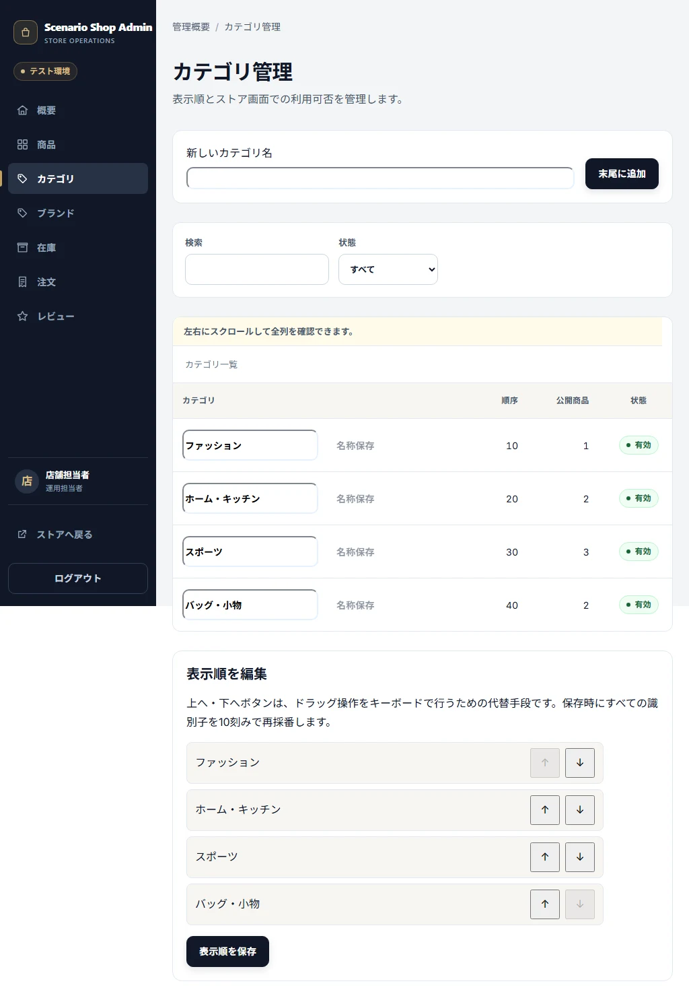](../assets/screens/SCREEN-ADMIN-CATEGORIES/default/web-tablet.webp)

### SCREEN-ADMIN-BRANDS — Admin Brands

Screen Catalog: [Screen Catalog](../screen-catalog.md)

#### Functions

- Brandの一覧、作成、編集、Validationを提供する。

#### Important UI States

| State slug | Type | Audience / Role | Condition / Scenario | Expected UI | Visual requirement | Required platforms | Visual detail | Related Oracle |
|---|---|---|---|---|---|---|---|---|
| `default` | baseline | `operator, admin` | `default` | Brand一覧と管理Formを表示する。 | `required` | `web-desktop, web-tablet` | `-` | `BR-ADMINCAT-002`, `AC-ADMINCAT-002` |

#### Visual References

##### `default`

###### Web Desktop

[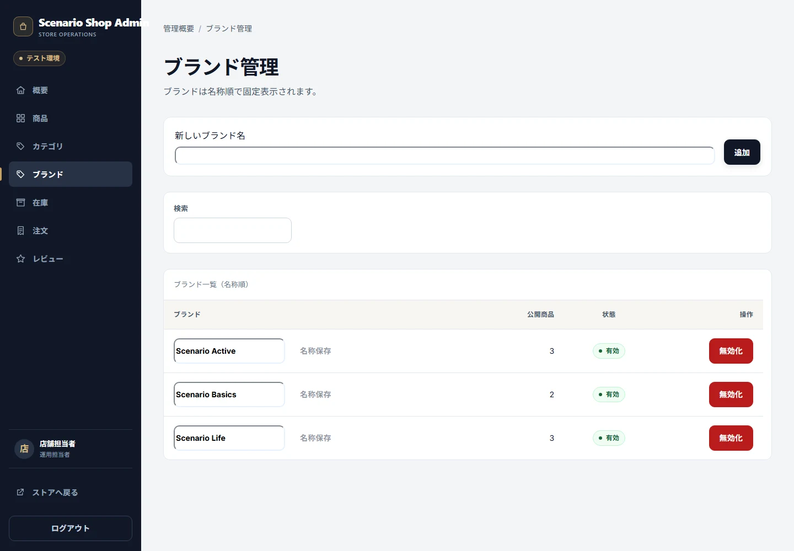](../assets/screens/SCREEN-ADMIN-BRANDS/default/web-desktop.webp)

###### Web Tablet

[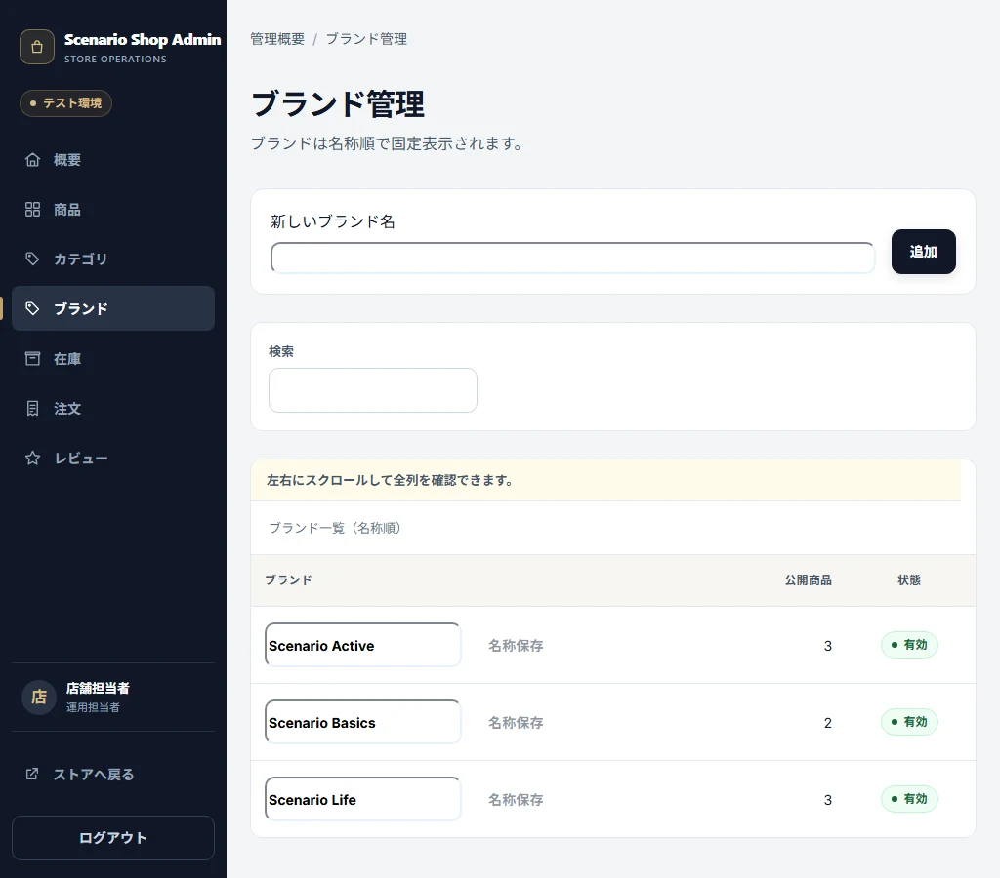](../assets/screens/SCREEN-ADMIN-BRANDS/default/web-tablet.webp)

## Acceptance Criteria

### Criteria

#### AC-ADMINCAT-001 — 不完全なProductを公開しない

Related BR: `BR-ADMINCAT-001`

必要なCategory、Brand、SKU、Image、Primary Imageを満たさないProductが公開されず、許可された状態遷移だけが成功します。

#### AC-ADMINCAT-002 — Previewと保存の責務を分離する

Related BR: `BR-ADMINCAT-002`

Preview、保存、初期在庫、Review Summary、Asset関連が各Transaction契約を満たし、PreviewだけではDBが変化しません。

## Executable Canonical Sources

- `src/application/use-cases/admin-product-use-cases.ts`
- `src/application/use-cases/admin-master-use-cases.ts`
- `src/domain/policies/state-transitions.ts`
- `src/infrastructure/image-assets/`
- `app/admin/products/`, `app/admin/categories/`, `app/admin/brands.tsx`
