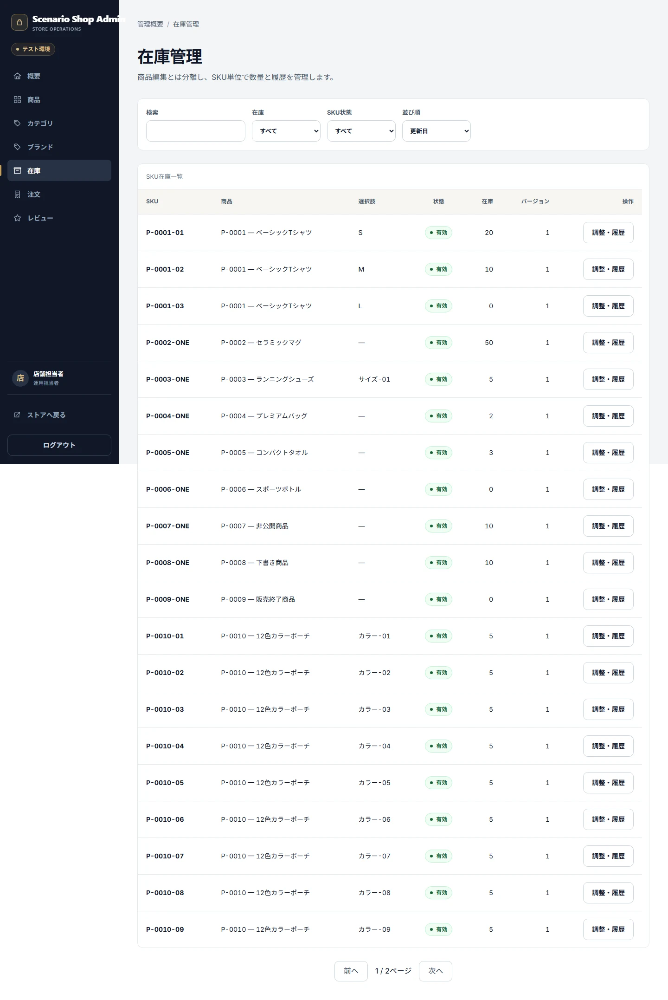
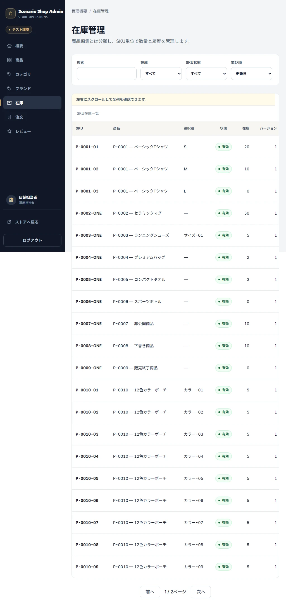

# Admin Inventory

## Purpose / Scope

Operator/AdminがSKU単位の在庫と在庫履歴を管理する契約を定義します。

## Business Rules

### BR-ADMININV-001 — 在庫はSKU単位の非負整数として調整する

在庫0はout_of_stock、1〜5はlow_stock、6以上はavailableとして扱い、在庫0をlow_stockへ二重計上しません。

### BR-ADMININV-002 — すべての在庫変更を履歴と一緒に保存する

Manual adjustmentとPayment成功時の購入減算は、Before/After、理由、Actor、Orderを含む履歴と同一Transactionで保存します。

## UI / Behavior Contract

在庫一覧はSKU単位のFilter、Search、Sortを提供し、Product一覧のAggregate stock表示とは境界を分けます。失敗時に部分更新を表示しません。

### SCREEN-ADMIN-INVENTORIES — Admin Inventories

Screen Catalog: [Screen Catalog](../screen-catalog.md)

#### Functions

- SKU単位の在庫、状態分類、Filter、Adjustment、Historyを表示する。
- 0 / 1-5 / 6+の境界とVersion Conflictを説明する。

#### Important UI States

| State slug | Type | Audience / Role | Condition / Scenario | Expected UI | Visual requirement | Required platforms | Visual detail | Related Oracle |
|---|---|---|---|---|---|---|---|---|
| `default` | baseline | `operator, admin` | `default` | 在庫一覧と状態分類を表示する。 | `required` | `web-desktop, web-tablet` | `-` | `BR-ADMININV-001`, `AC-ADMININV-001` |
| `stock-boundaries` | boundary | `operator, admin` | `default` | 0、1-5、6+を異なる状態として表示する。 | `required` | `web-desktop` | `-` | `BR-ADMININV-001`, `AC-ADMININV-001` |

#### Visual References

##### `default`

###### Web Desktop

###### Web Tablet

##### `stock-boundaries`

###### Web Desktop

## Acceptance Criteria

### Criteria

#### AC-ADMININV-001 — 在庫状態を正しく分類する

Related BR: `BR-ADMININV-001`

0、1、5、6の各境界でSKU一覧とProduct Overviewの表示・件数が分類契約と一致します。

#### AC-ADMININV-002 — 在庫履歴をAtomicに保存する

Related BR: `BR-ADMININV-002`

調整または購入成功時に在庫値と履歴が一致し、失敗時は両方が変更されません。

## Executable Canonical Sources

- `src/application/use-cases/admin-operations-use-cases.ts`
- `src/domain/contracts/entities.ts`
- `src/infrastructure/database/dexie/`
- `app/admin/inventories.tsx`
