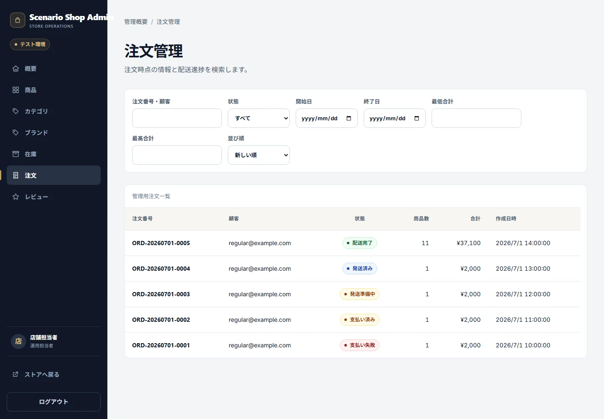
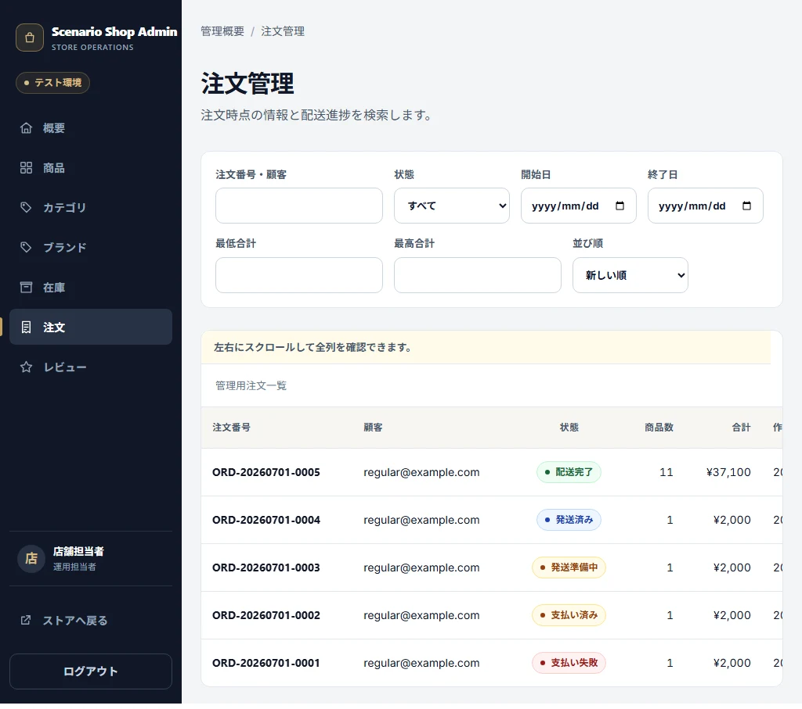
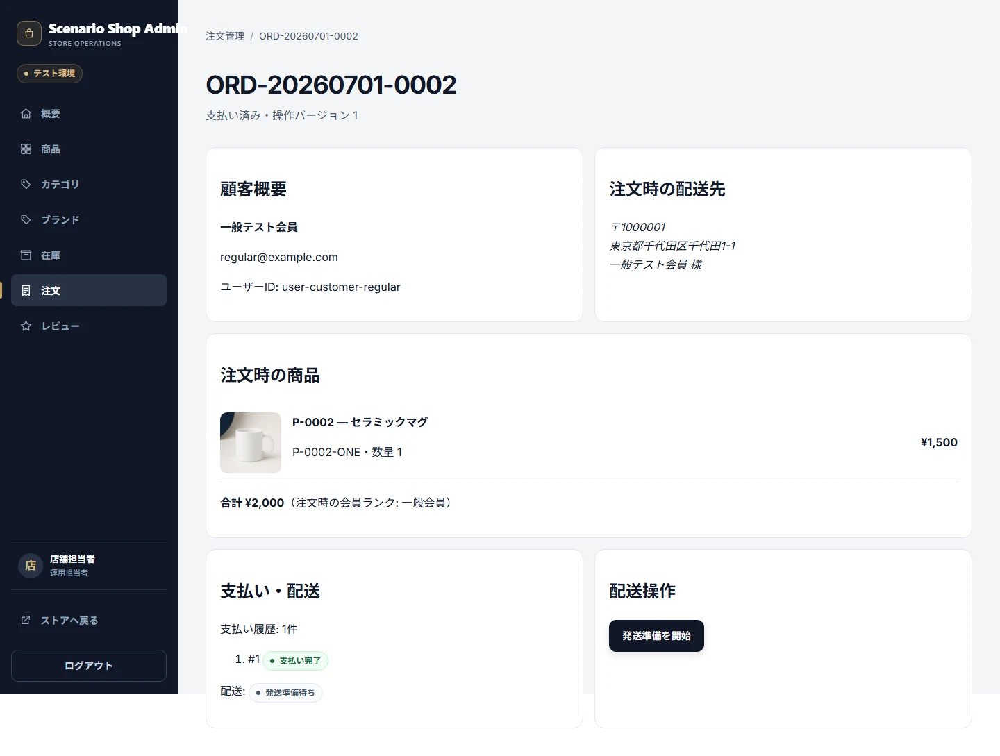
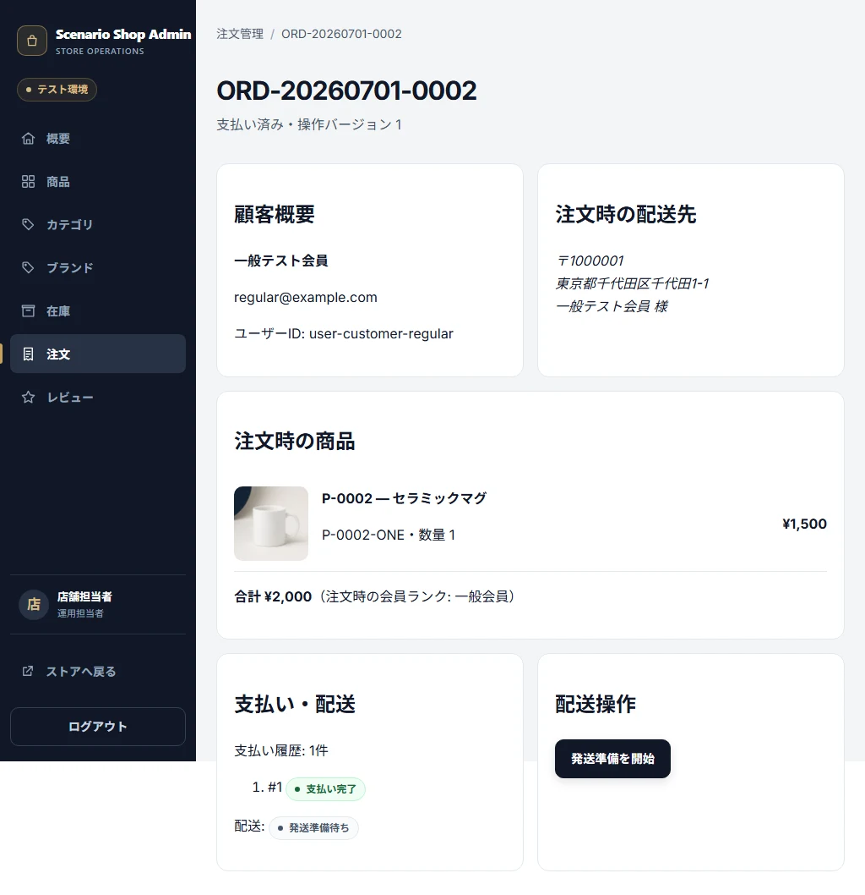

# Admin Orders

## Purpose / Scope

Operator/AdminがOrderを準備、発送、配送完了へ進める管理契約を定義します。

## Business Rules

### BR-ADMINORD-001 — OrderとShipmentを同じ状態順で進める

paid → preparing、preparing → shipped、shipped → deliveredだけを許可し、対応するShipmentも同じTransactionで更新します。

## UI / Behavior Contract

Order一覧/詳細はCustomer Snapshot、現在状態、次Action、Order Action Version、Shipment情報を表示します。古いVersionでの操作はConflictとして拒否します。

### SCREEN-ADMIN-ORDERS — Admin Orders

Screen Catalog: [Screen Catalog](../screen-catalog.md)

#### Functions

- Order一覧、Payment、Shipment Status、Filterを表示する。
- Order DetailのVersion付きActionへ進める。

#### Important UI States

| State slug | Type | Audience / Role | Condition / Scenario | Expected UI | Visual requirement | Required platforms | Visual detail | Related Oracle |
|---|---|---|---|---|---|---|---|---|
| `default` | baseline | `operator, admin` | `orders-phase1-statuses` | 複数StatusのOrder一覧を表示する。 | `required` | `web-desktop, web-tablet` | `-` | `BR-ADMINORD-001`, `AC-ADMINORD-001` |

#### Visual References

##### `default`

###### Web Desktop

###### Web Tablet

### SCREEN-ADMIN-ORDER-DETAIL — Admin Order Detail

Screen Catalog: [Screen Catalog](../screen-catalog.md)

#### Functions

- Customer Snapshot、Order / Shipment Status、次Action、Versionを表示する。
- 許可された状態遷移だけを実行する。

#### Important UI States

| State slug | Type | Audience / Role | Condition / Scenario | Expected UI | Visual requirement | Required platforms | Visual detail | Related Oracle |
|---|---|---|---|---|---|---|---|---|
| `default` | baseline | `operator, admin` | `orders-phase1-statuses` | Order Detailと次Actionを表示する。 | `required` | `web-desktop, web-tablet` | `-` | `BR-ADMINORD-001`, `AC-ADMINORD-001` |

#### Visual References

##### `default`

###### Web Desktop

###### Web Tablet

## Acceptance Criteria

### Criteria

#### AC-ADMINORD-001 — 配送操作をVersion付きで実行する

Related BR: `BR-ADMINORD-001`

準備、発送、配送完了が順序とVersionを守り、OrderだけまたはShipmentだけが更新される状態を作りません。

## Executable Canonical Sources

- `src/application/use-cases/admin-operations-use-cases.ts`
- `src/domain/policies/state-transitions.ts`
- `app/admin/orders/`
