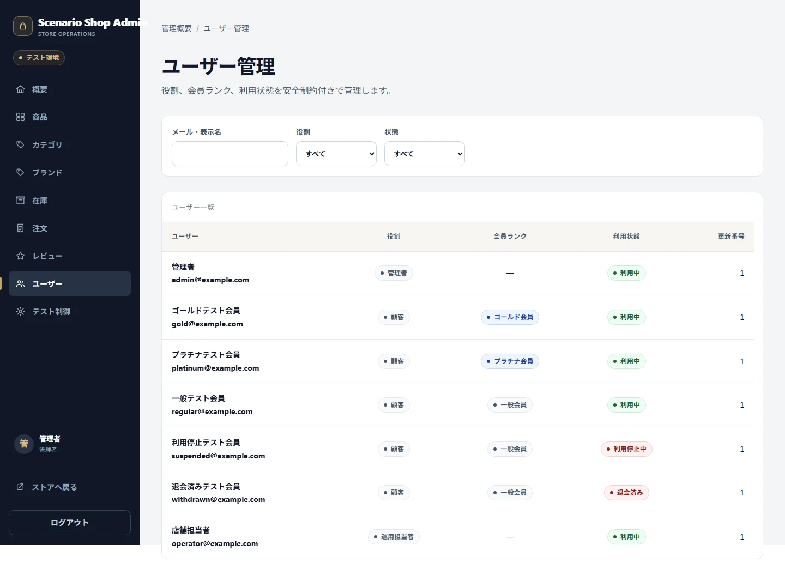
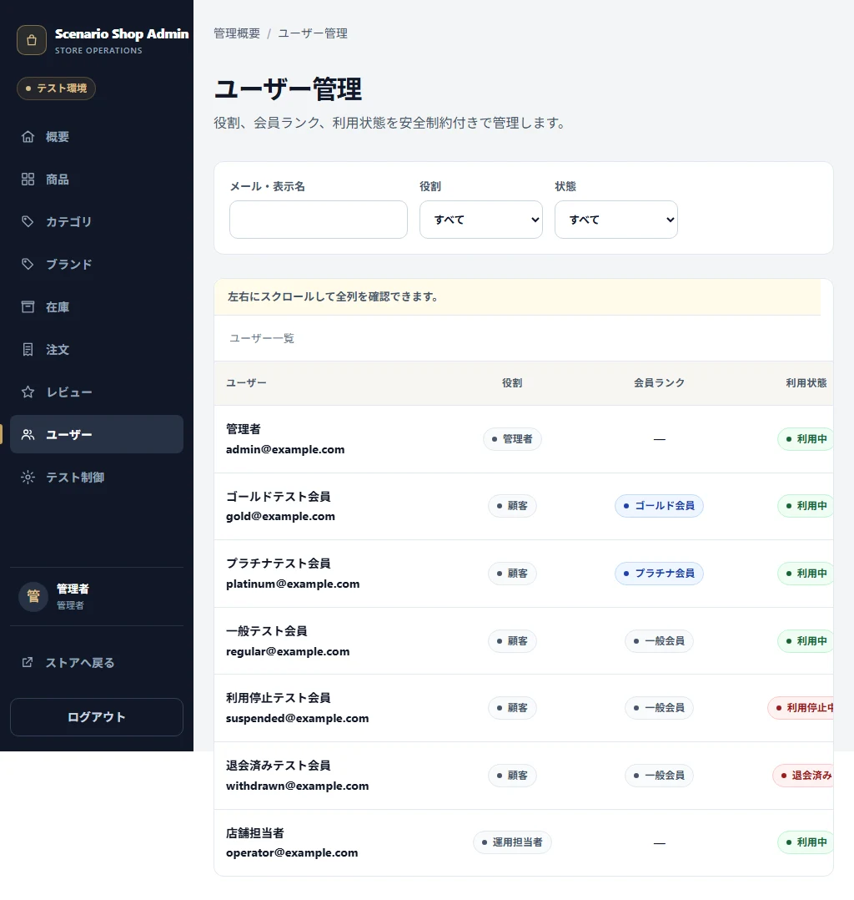
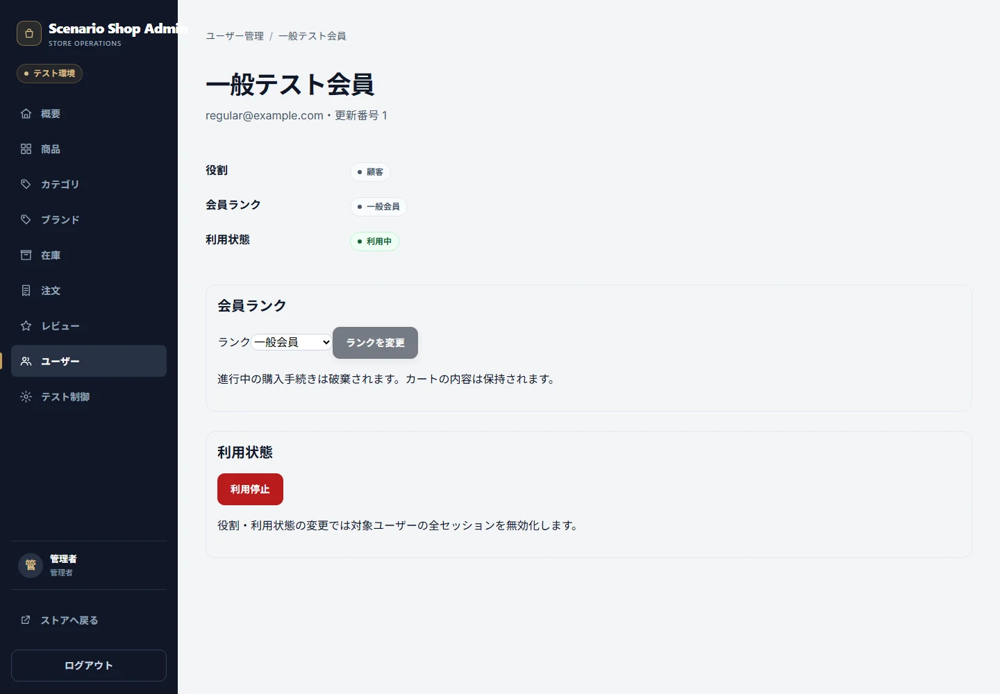
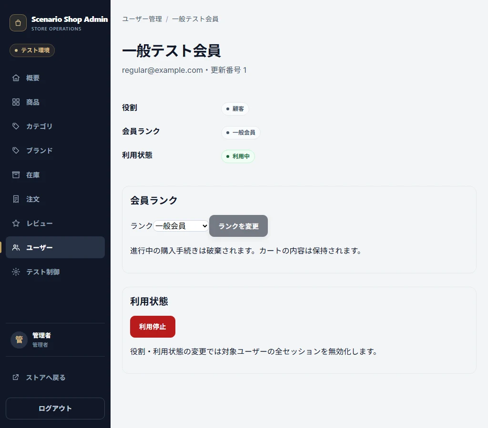

# Admin Users

## Purpose / Scope

AdminがUserのCustomer Rank、Operator/Admin Role、Account Statusを管理する契約を定義します。

## Business Rules

### BR-ADMINUSER-001 — User変更はRole、Status、最終Admin保護を守る

Customer RankはCustomer内だけ、Roleはoperator/admin間だけ、Statusはactive/suspended間だけ変更できます。最後のAdmin、自己破壊的変更、withdrawn操作は拒否します。

## UI / Behavior Contract

拒否理由を説明し、Customerの自分自身のRole/StatusやwithdrawnのMutationを操作可能に見せません。Status変更時は必要なSession/Checkoutの無効化を利用者へ説明します。

### SCREEN-ADMIN-USERS — Admin Users

Screen Catalog: [Screen Catalog](../screen-catalog.md)

#### Functions

- UserのRole、Rank、Account Status、Filterを表示する。
- Customer自身、withdrawn、最後のAdminなどのMutation境界を説明する。

#### Important UI States

| State slug | Type | Audience / Role | Condition / Scenario | Expected UI | Visual requirement | Required platforms | Visual detail | Related Oracle |
|---|---|---|---|---|---|---|---|---|
| `default` | baseline | `admin` | `default` | User一覧とStatus/Roleを表示する。 | `required` | `web-desktop, web-tablet` | `-` | `BR-ADMINUSER-001`, `AC-ADMINUSER-001` |

#### Visual References

##### `default`

###### Web Desktop

###### Web Tablet

### SCREEN-ADMIN-USER-DETAIL — Admin User Detail

Screen Catalog: [Screen Catalog](../screen-catalog.md)

#### Functions

- User Detailと許可されたRole / Rank / Status操作を表示する。
- 自己破壊的変更、withdrawn mutation、最後のAdmin変更を操作可能に見せない。

#### Important UI States

| State slug | Type | Audience / Role | Condition / Scenario | Expected UI | Visual requirement | Required platforms | Visual detail | Related Oracle |
|---|---|---|---|---|---|---|---|---|
| `default` | baseline | `admin` | `default` | User Detailと保護理由を表示する。 | `required` | `web-desktop, web-tablet` | `-` | `BR-ADMINUSER-001`, `AC-ADMINUSER-001` |

#### Visual References

##### `default`

###### Web Desktop

###### Web Tablet

## Acceptance Criteria

### Criteria

#### AC-ADMINUSER-001 — User Mutationの境界を守る

Related BR: `BR-ADMINUSER-001`

許可されたRank/Role/Status変更だけが成功し、最後のAdmin、自己変更、withdrawn、Role不整合が拒否されます。

## Executable Canonical Sources

- `src/application/use-cases/admin-master-use-cases.ts`
- `src/domain/policies/permissions.ts`
- `app/admin/users/`
