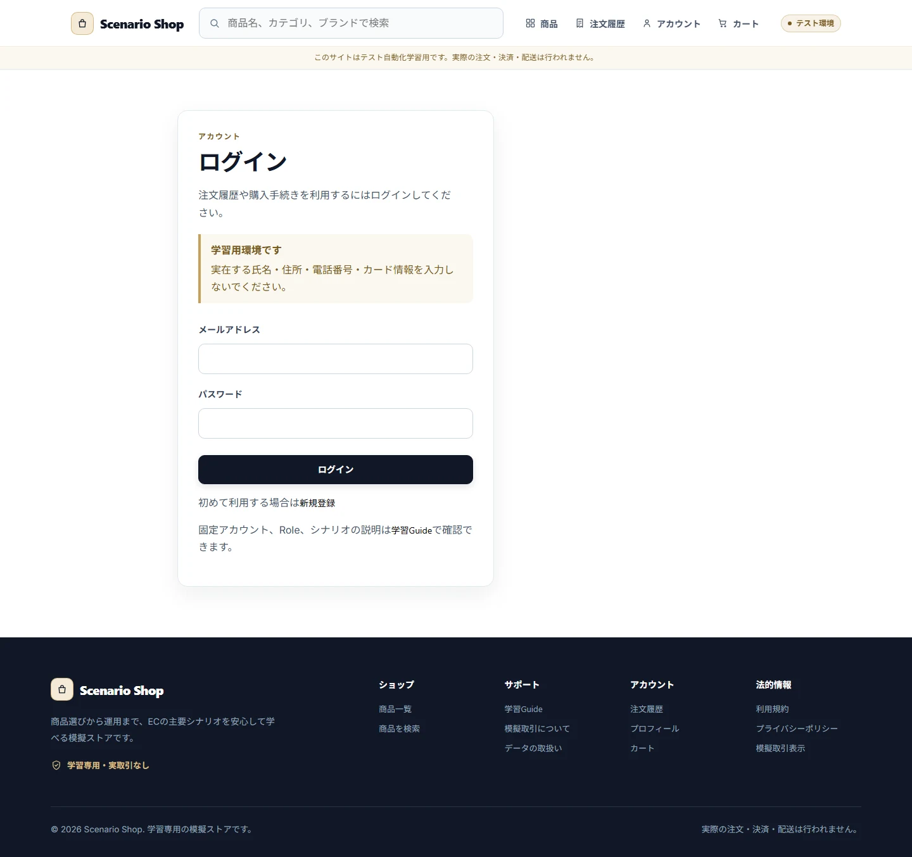
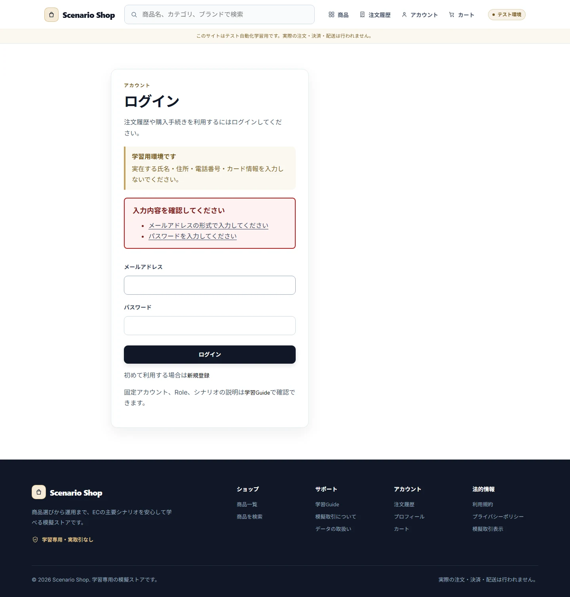
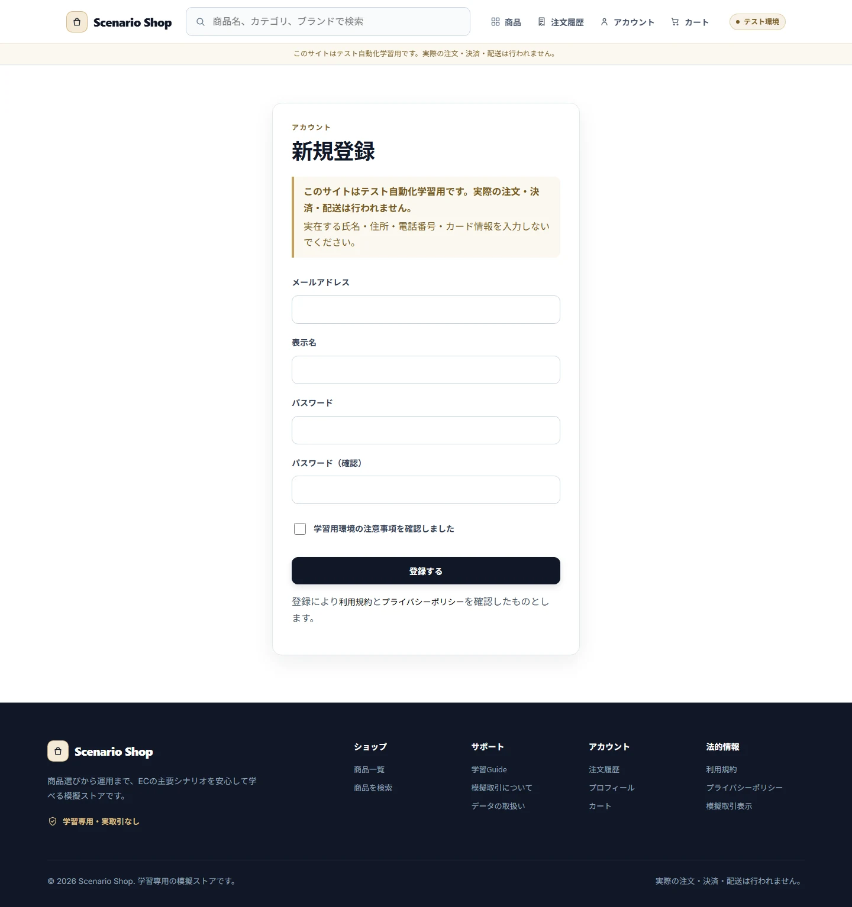
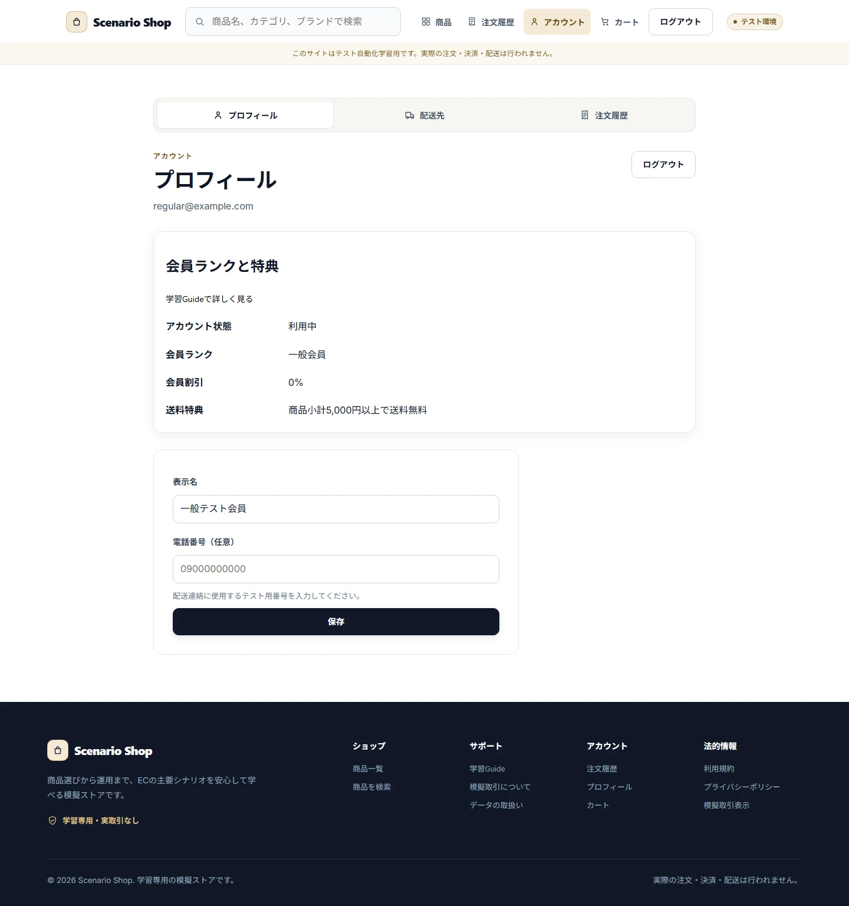

# Authentication

## Purpose / Scope

Login、Signup、Session、Account Status、Role、Customer向けReturn先、Guest Cart統合を定義します。

## Business Rules

### BR-AUTH-001 — LoginはAccount StatusとRoleを検証してSessionを作る

activeなAccountだけがLoginできます。Signupで作成されたactiveなAccountを含みます。suspended/withdrawnは拒否し、Sessionを作成しません。

### BR-AUTH-002 — Customer以外のCapabilityを購入導線へ渡さない

CustomerだけがCheckoutとCustomer Dataを使い、operator/adminはStore管理だけを行います。Login成功時もRoleに応じたShellへ遷移します。

## UI / Behavior Contract

失敗理由は利用者向け文言で表示し、内部HashやActor IDを露出しません。Customer Login時は許可された内部Return先だけへ戻り、外部・親相対Pathは受け付けません。

### SCREEN-AUTH-LOGIN — Login

Screen Catalog: [Screen Catalog](../screen-catalog.md)

#### Functions

- Email / passwordを受け取り、許可されたAccount StatusとRoleを検証する。
- Login拒否理由を利用者向け文言で表示し、安全な内部Return先だけを採用する。

#### Important UI States

| State slug | Type | Audience / Role | Condition / Scenario | Expected UI | Visual requirement | Required platforms | Visual detail | Related Oracle |
|---|---|---|---|---|---|---|---|---|
| `default` | baseline | `guest` | `default` | Login formとSignup導線を表示する。 | `required` | `web-desktop, android` | `-` | `BR-AUTH-001`, `AC-AUTH-001` |
| `validation-error` | error | `guest` | `storage-write-failure` | 必須入力の不足をSummaryで説明する。 | `required` | `web-desktop` | `-` | `BR-AUTH-001`, `AC-AUTH-001` |

#### Visual References

##### `default`

###### Web Desktop

##### `validation-error`

###### Web Desktop

### SCREEN-AUTH-SIGNUP — Signup

Screen Catalog: [Screen Catalog](../screen-catalog.md)

#### Functions

- 新規Customerの表示名、Email、passwordを受け付ける。
- Validationと重複を説明し、成功時に安全な購入入口へ遷移する。

#### Important UI States

| State slug | Type | Audience / Role | Condition / Scenario | Expected UI | Visual requirement | Required platforms | Visual detail | Related Oracle |
|---|---|---|---|---|---|---|---|---|
| `default` | baseline | `guest` | `default` | Signup formを表示する。 | `required` | `web-desktop, android` | `-` | `BR-AUTH-001`, `AC-AUTH-001` |
| `validation-error` | error | `guest` | `default` | 入力エラーと修正方法を表示する。 | `not-applicable` | `-` | `reason: 同じform validationの視覚差分はLoginのvalidation referenceで代表する` | `AC-AUTH-001` |

#### Visual References

##### `default`

###### Web Desktop

##### `validation-error`

### SCREEN-AUTH-ACCOUNT-PROFILE — Account Profile

Screen Catalog: [Screen Catalog](../screen-catalog.md)

#### Functions

- Customer自身のProfile、Rank、Account Statusを表示する。
- Customer以外のCapabilityや内部IDを表示しない。

#### Important UI States

| State slug | Type | Audience / Role | Condition / Scenario | Expected UI | Visual requirement | Required platforms | Visual detail | Related Oracle |
|---|---|---|---|---|---|---|---|---|
| `default` | baseline | `customer` | `regular-member` | ProfileとRank benefitを表示する。 | `required` | `web-desktop, android` | `-` | `BR-AUTH-002`, `AC-AUTH-002` |

#### Visual References

##### `default`

###### Web Desktop

## Acceptance Criteria

### Criteria

#### AC-AUTH-001 — Login拒否時にSessionを作らない

Related BR: `BR-AUTH-001`

active、suspended、withdrawnのAccountで、成功/拒否、Session有無、画面のエラーを確認できます。

#### AC-AUTH-002 — Role境界と安全なReturn先を守る

Related BR: `BR-AUTH-002`

Customer、operator、adminで表示Capabilityと遷移先が分離され、外部または不正なReturn先が採用されません。

## Executable Canonical Sources

- `src/application/use-cases/auth-use-cases.ts`
- `src/domain/policies/permissions.ts`
- `src/presentation/browser/return-to.web.ts`
- `src/seeds/default-dataset.ts`
- `app/login.tsx`, `app/signup.tsx`, `app/_layout.tsx`
