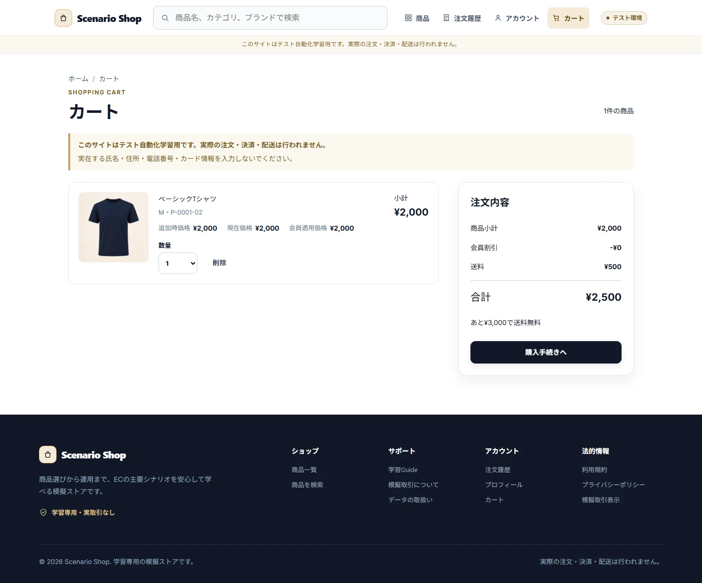
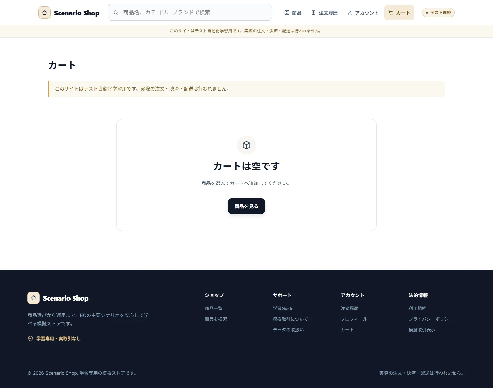
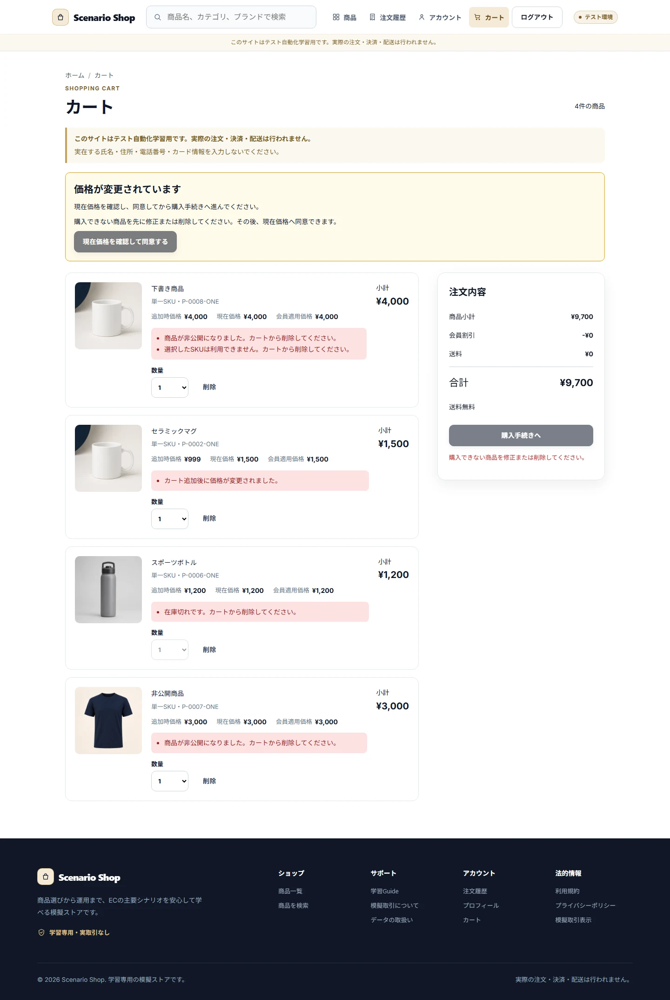

# Cart

## Purpose / Scope

Guest/Customer Cartの追加、数量変更、削除、再検証、Login時のGuest Cart統合を定義します。Order変換はCheckout/Orders Featureで定義します。

## Business Rules

### BR-CART-001 — Cart数量は在庫・購入上限・99の最小値を超えない

同一SKUは合算し、上限超過は自動補正せず操作全体を拒否して現在数量を維持します。数量0は明細削除です。

### BR-CART-002 — Login時はUser Cartを基準にGuest Cartを統合する

SKU単位で合算し、許容上限を超える分、非公開、Rank不足、無効SKU、在庫0を除外して理由を示します。Guest Cartはabandonedへ遷移します。

### BR-CART-003 — Cart表示とCheckout開始で商品状態を再検証する

公開、権限、価格、在庫を再検証し、価格変更はCustomer承認までCheckoutへ進めません。

## UI / Behavior Contract

Cartはguest/customerだけが利用できます。明細には商品、画像、現在価格、数量、上限、問題、合計、Empty Stateを表示し、更新中は同一CartのMutation操作を二重実行できません。

### SCREEN-STOREFRONT-CART — Cart

Screen Catalog: [Screen Catalog](../screen-catalog.md)

#### Functions

- Guest / Customer Cartの明細、数量、現在価格、問題理由、合計を表示する。
- 在庫、購入上限、公開状態、価格を再検証し、問題を修正または削除できるようにする。

#### Important UI States

| State slug | Type | Audience / Role | Condition / Scenario | Expected UI | Visual requirement | Required platforms | Visual detail | Related Oracle |
|---|---|---|---|---|---|---|---|---|
| `default` | baseline | `guest, customer` | `default` | Cart明細と数量操作を表示する。 | `required` | `web-desktop, android` | `-` | `BR-CART-001`, `AC-CART-001` |
| `empty` | empty | `guest, customer` | `default` | Cartが空であることと商品探索導線を表示する。 | `required` | `web-desktop` | `-` | `BR-CART-001` |
| `invalid-items` | error | `guest, customer` | `cart-with-invalid-items` | 購入不可理由と修正Actionを表示する。 | `required` | `web-desktop` | `-` | `BR-CART-003`, `AC-CART-003` |

#### Visual References

##### `default`

###### Web Desktop

##### `empty`

###### Web Desktop

##### `invalid-items`

###### Web Desktop

## Acceptance Criteria

### Criteria

#### AC-CART-001 — 上限超過を拒否する

Related BR: `BR-CART-001`

在庫、購入上限、99の各境界で、超過時に数量が補正されず現在値が維持されます。

#### AC-CART-002 — Guest Cartを会員Cartへ統合する

Related BR: `BR-CART-002`

Guest明細とUser明細の統合結果、除外理由、Cart Version、Guest Cartの状態が一致します。

#### AC-CART-003 — 問題明細をCheckoutへ進めない

Related BR: `BR-CART-003`

価格変更、在庫切れ、公開不可、Rank不足が再検証され、承認または修正なしにCheckoutへ進みません。

## Executable Canonical Sources

- `src/application/use-cases/cart-use-cases.ts`
- `src/domain/services/cart.ts`
- `src/domain/policies/permissions.ts`
- `src/seeds/scenarios.ts`
- `app/cart.tsx`, `app/cart.native.tsx`
