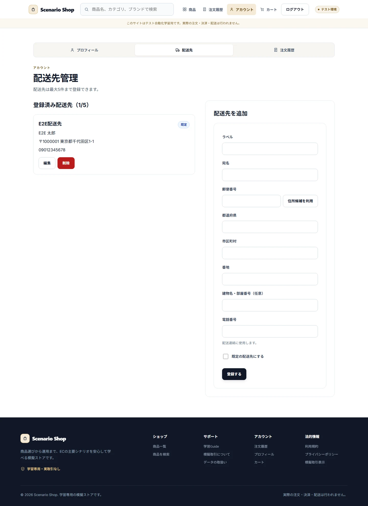
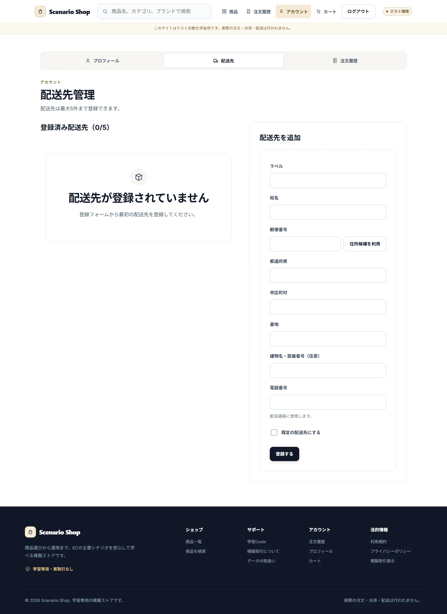
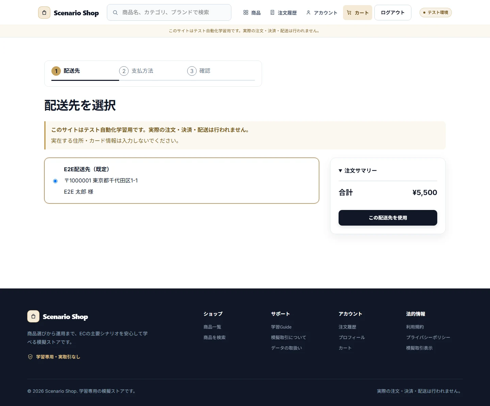
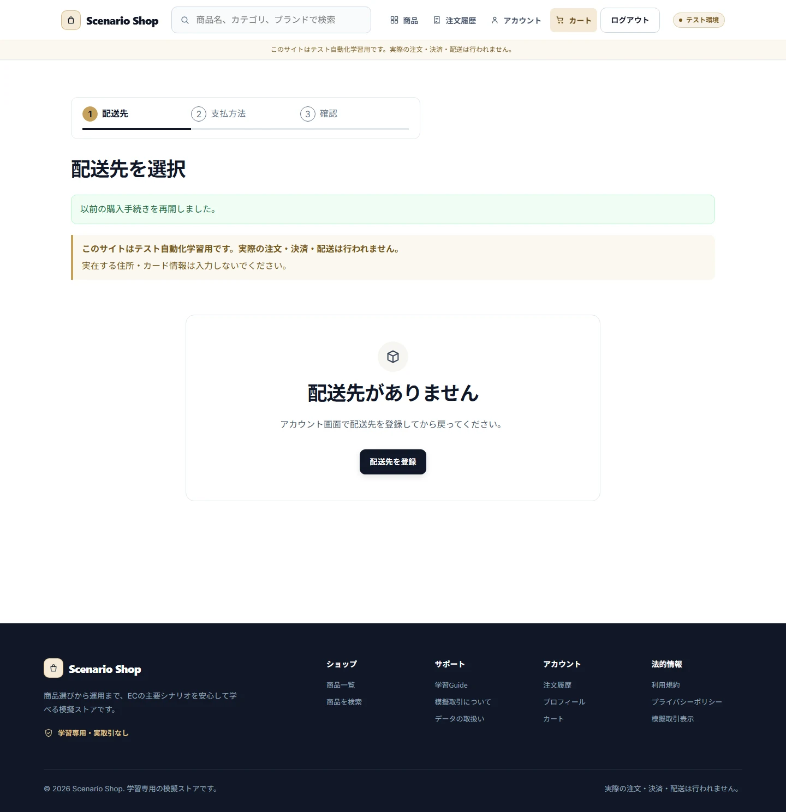
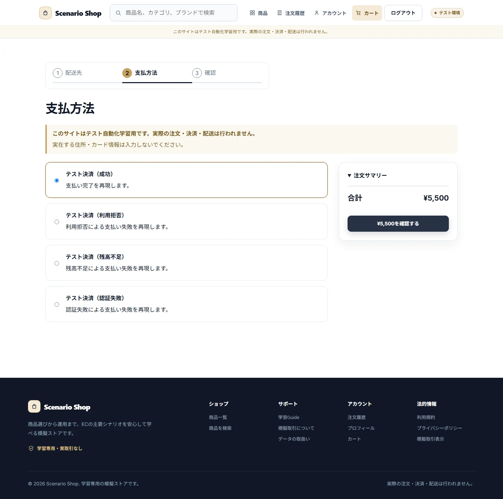
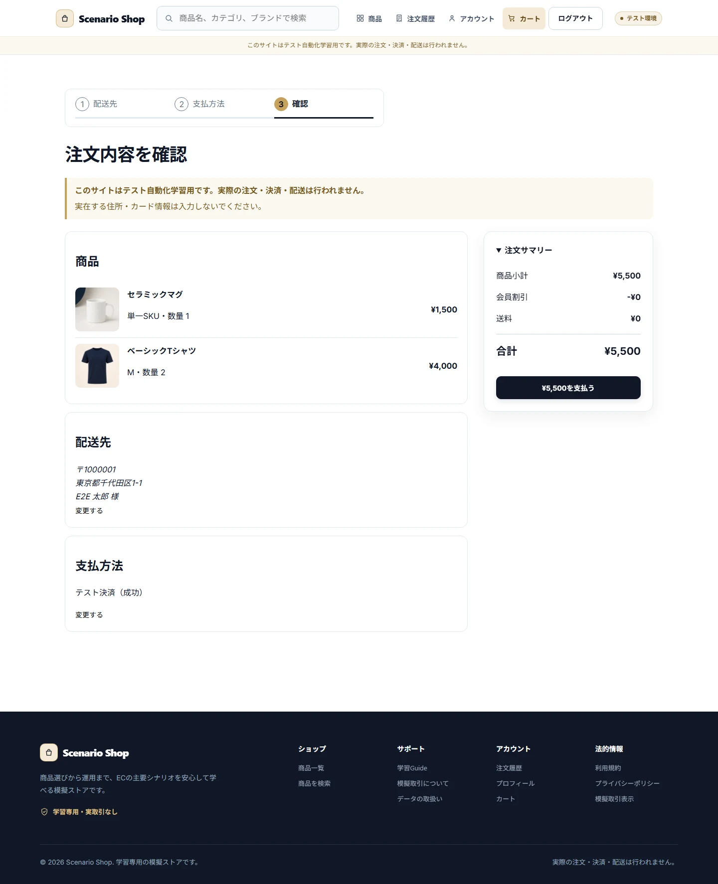
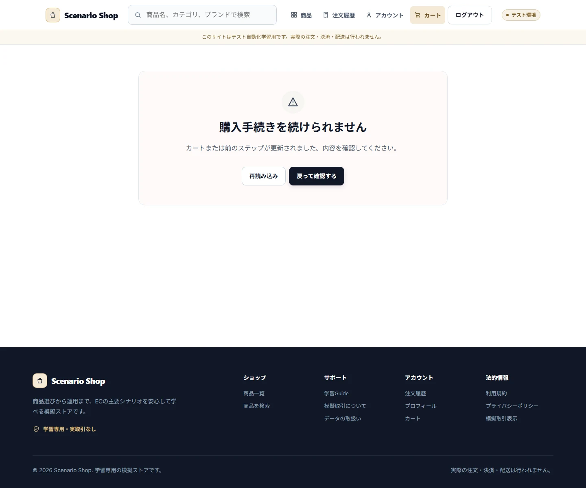
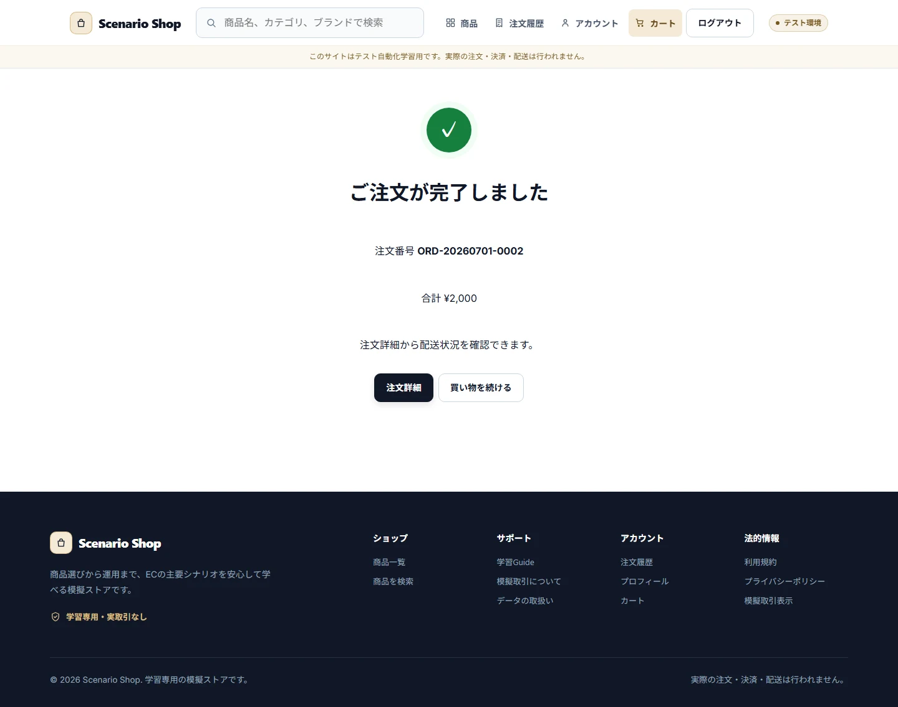
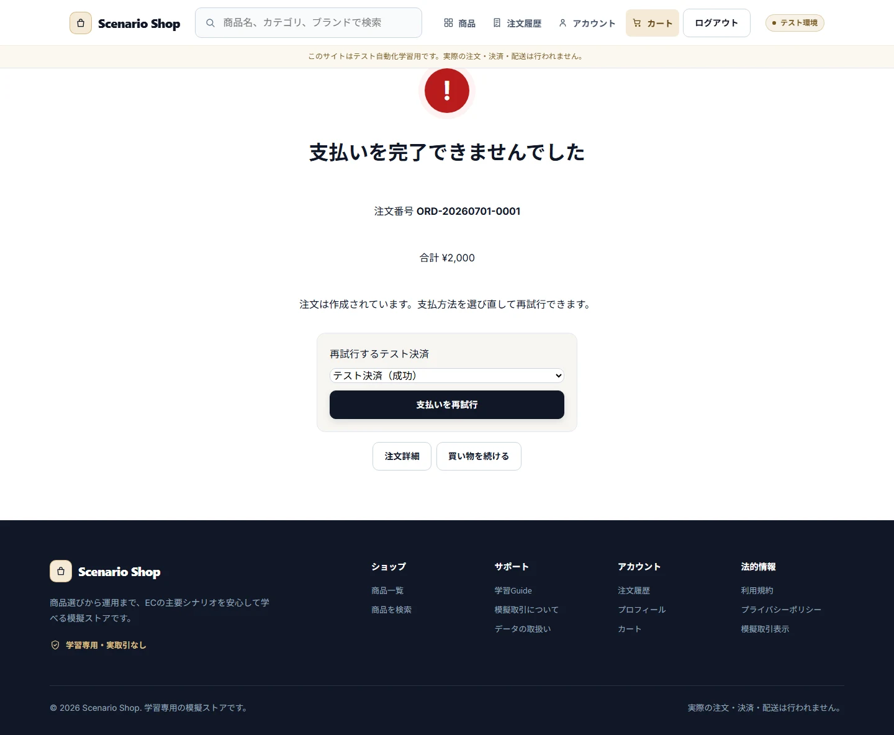

# Checkout and Payment

## Purpose / Scope

CustomerのAddress、Checkout Session、Cart Version、価格確認、Local Mock Payment、Processing/Complete/FailedのBoundaryを定義します。

## Business Rules

### BR-CHECKOUT-001 — CustomerごとのCheckout Sessionを再開または置換する

同じUser、Cart、Cart Versionのactive Sessionは再開し、異なるCart/Versionなら旧Sessionをabandonedにして新しいSessionを作ります。Sessionは24時間でexpiredです。

### BR-CHECKOUT-002 — Cart Versionと価格をOrder作成直前に再検証する

不一致または価格差異があればOrder/Paymentを作らずCartへ戻します。直接URLは不足Stepへ戻します。

### BR-CHECKOUT-003 — Mock Payment結果をOrder/Inventoryと一貫して確定する

TEST-SUCCESSだけが在庫を再検証してPayment succeeded、Order paid、在庫減算を確定します。明確な失敗はpayment_failedとし、在庫を変更しません。processing中は再試行とCancelを禁止します。

## UI / Behavior Contract

Address、Payment、Confirm、Processing、Complete、Failedの各画面はOrder所有権とPayment状態を検証します。Payment DelayはTest Controlで変更できますが、外部通信は行いません。

### SCREEN-CHECKOUT-ADDRESSES — Addresses

Screen Catalog: [Screen Catalog](../screen-catalog.md)

#### Functions

- Customer自身の配送先を一覧表示し、追加・編集・選択へ進める。
- 未登録時にCheckoutへ進むための登録導線を表示する。

#### Important UI States

| State slug | Type | Audience / Role | Condition / Scenario | Expected UI | Visual requirement | Required platforms | Visual detail | Related Oracle |
|---|---|---|---|---|---|---|---|---|
| `default` | baseline | `customer` | `regular-member` | 配送先一覧と管理Actionを表示する。 | `required` | `web-desktop, android` | `-` | `BR-CHECKOUT-001`, `AC-CHECKOUT-001` |
| `empty` | empty | `customer` | `default` | 未登録状態と追加Formへの導線を表示する。 | `required` | `web-desktop` | `-` | `BR-CHECKOUT-001`, `AC-CHECKOUT-001` |

#### Visual References

##### `default`

###### Web Desktop

##### `empty`

###### Web Desktop

### SCREEN-CHECKOUT-ADDRESS — Checkout Address

Screen Catalog: [Screen Catalog](../screen-catalog.md)

#### Functions

- Checkout Sessionの配送先を選択し、Paymentへ進める。
- Resume / replaced / stale状態のNoticeと次Actionを表示する。

#### Important UI States

| State slug | Type | Audience / Role | Condition / Scenario | Expected UI | Visual requirement | Required platforms | Visual detail | Related Oracle |
|---|---|---|---|---|---|---|---|---|
| `default` | baseline | `customer` | `regular-member` | 配送先選択と次Step Actionを表示する。 | `required` | `web-desktop, android` | `-` | `BR-CHECKOUT-001`, `AC-CHECKOUT-001` |
| `resume-notice` | transient | `customer` | `checkout-resume` | 再開したCheckout Sessionを一度だけ通知する。 | `required` | `web-desktop` | `-` | `BR-CHECKOUT-001`, `AC-CHECKOUT-001` |

#### Visual References

##### `default`

###### Web Desktop

##### `resume-notice`

###### Web Desktop

### SCREEN-CHECKOUT-PAYMENT — Checkout Payment

Screen Catalog: [Screen Catalog](../screen-catalog.md)

#### Functions

- Mock Payment optionを選択し、Confirmへ進める。
- 不完全なSessionやCart Version不一致を安全に扱う。

#### Important UI States

| State slug | Type | Audience / Role | Condition / Scenario | Expected UI | Visual requirement | Required platforms | Visual detail | Related Oracle |
|---|---|---|---|---|---|---|---|---|
| `default` | baseline | `customer` | `regular-member` | Payment optionと確認Actionを表示する。 | `required` | `web-desktop, android` | `-` | `BR-CHECKOUT-002`, `AC-CHECKOUT-002` |

#### Visual References

##### `default`

###### Web Desktop

### SCREEN-CHECKOUT-CONFIRM — Checkout Confirm

Screen Catalog: [Screen Catalog](../screen-catalog.md)

#### Functions

- Order内容、配送先、価格、Paymentを最終確認する。
- stale Cart / price conflict時は確定せず修正導線を表示する。

#### Important UI States

| State slug | Type | Audience / Role | Condition / Scenario | Expected UI | Visual requirement | Required platforms | Visual detail | Related Oracle |
|---|---|---|---|---|---|---|---|---|
| `default` | baseline | `customer` | `regular-member` | Order内容と確定Actionを表示する。 | `required` | `web-desktop, android` | `-` | `BR-CHECKOUT-002`, `AC-CHECKOUT-002` |
| `stale-cart` | conflict | `customer` | `cart-version-invalidates-checkout` | 不一致を説明しCartまたは該当Stepへ戻す。 | `required` | `web-desktop` | `-` | `BR-CHECKOUT-002`, `AC-CHECKOUT-002` |

#### Visual References

##### `default`

###### Web Desktop

##### `stale-cart`

###### Web Desktop

### SCREEN-CHECKOUT-PROCESSING — Checkout Processing

Screen Catalog: [Screen Catalog](../screen-catalog.md)

#### Functions

- Payment processing中の状態とReload / resumeの導線を表示する。
- Processing中の二重確定、Retry、Cancelを許可しない。

#### Important UI States

| State slug | Type | Audience / Role | Condition / Scenario | Expected UI | Visual requirement | Required platforms | Visual detail | Related Oracle |
|---|---|---|---|---|---|---|---|---|
| `default` | baseline | `customer` | `payment-processing` | Payment処理中と待機Actionを表示する。 | `required` | `web-desktop, android` | `-` | `BR-CHECKOUT-003`, `AC-CHECKOUT-003` |

#### Visual References

##### `default`

### SCREEN-CHECKOUT-COMPLETE — Checkout Complete

Screen Catalog: [Screen Catalog](../screen-catalog.md)

#### Functions

- Payment成功、Order番号、注文履歴への導線を表示する。

#### Important UI States

| State slug | Type | Audience / Role | Condition / Scenario | Expected UI | Visual requirement | Required platforms | Visual detail | Related Oracle |
|---|---|---|---|---|---|---|---|---|
| `default` | baseline | `customer` | `default` | 注文完了とOrder確認Actionを表示する。 | `required` | `web-desktop, android` | `-` | `BR-CHECKOUT-003`, `AC-CHECKOUT-003` |

#### Visual References

##### `default`

###### Web Desktop

### SCREEN-CHECKOUT-FAILED — Checkout Failed

Screen Catalog: [Screen Catalog](../screen-catalog.md)

#### Functions

- Payment拒否、再試行、Cart / Order確認への導線を表示する。
- Payment失敗時に在庫やOrderを成功状態へ変更しない。

#### Important UI States

| State slug | Type | Audience / Role | Condition / Scenario | Expected UI | Visual requirement | Required platforms | Visual detail | Related Oracle |
|---|---|---|---|---|---|---|---|---|
| `default` | baseline | `customer` | `payment-declined` | 失敗理由と再試行Actionを表示する。 | `required` | `web-desktop, android` | `-` | `BR-CHECKOUT-003`, `AC-CHECKOUT-003` |

#### Visual References

##### `default`

###### Web Desktop

## Acceptance Criteria

### Criteria

#### AC-CHECKOUT-001 — Sessionを再開・置換する

Related BR: `BR-CHECKOUT-001`

同一Cart/Versionの再開、異なるVersionの置換、期限切れ、Logout後の再Login復帰が確認できます。

#### AC-CHECKOUT-002 — Stale Cartを確定しない

Related BR: `BR-CHECKOUT-002`

Cart Versionまたは価格が変わった状態で、Order/Paymentが作成されず、必要なStepまたはCartへ戻ります。

#### AC-CHECKOUT-003 — Payment結果を一度だけ確定する

Related BR: `BR-CHECKOUT-003`

成功、明確な拒否、processing再開、最終在庫不足で、Order、Payment、Inventory、Historyの整合が保たれます。

## Executable Canonical Sources

- `src/application/use-cases/checkout-order-use-cases.ts`
- `src/infrastructure/payment/mock-payment-gateway.ts`
- `src/domain/policies/state-transitions.ts`
- `src/test-controls/`
- `app/checkout/`, `app/checkout/*.native.tsx`
