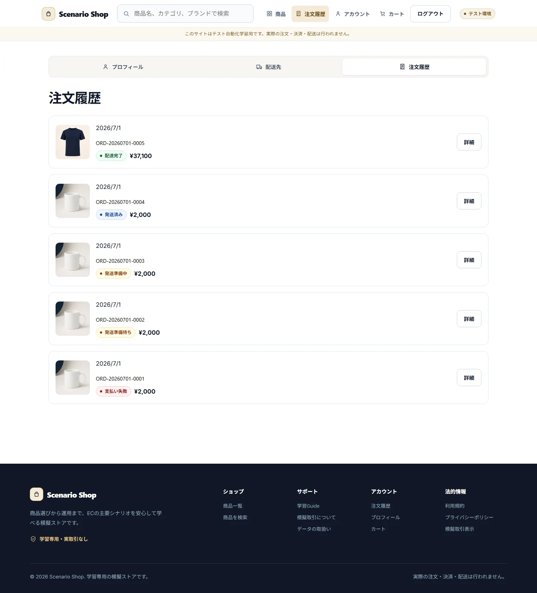
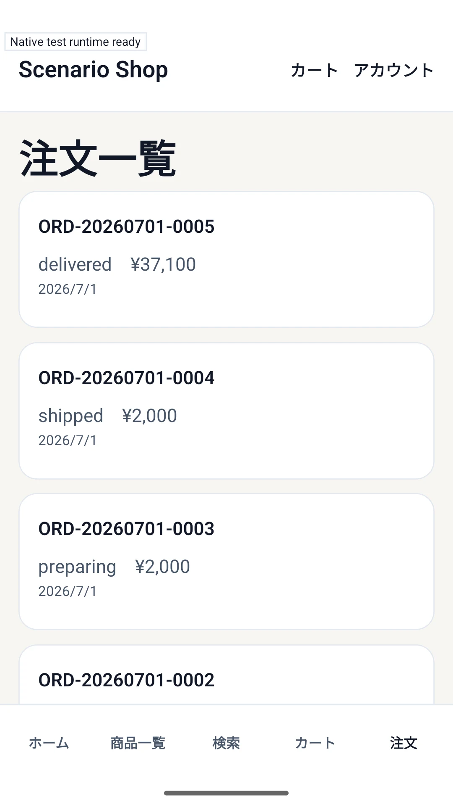
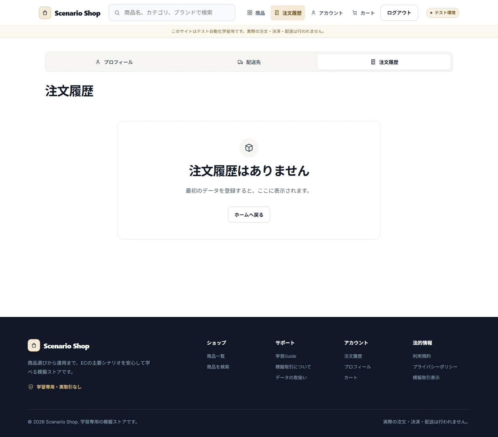
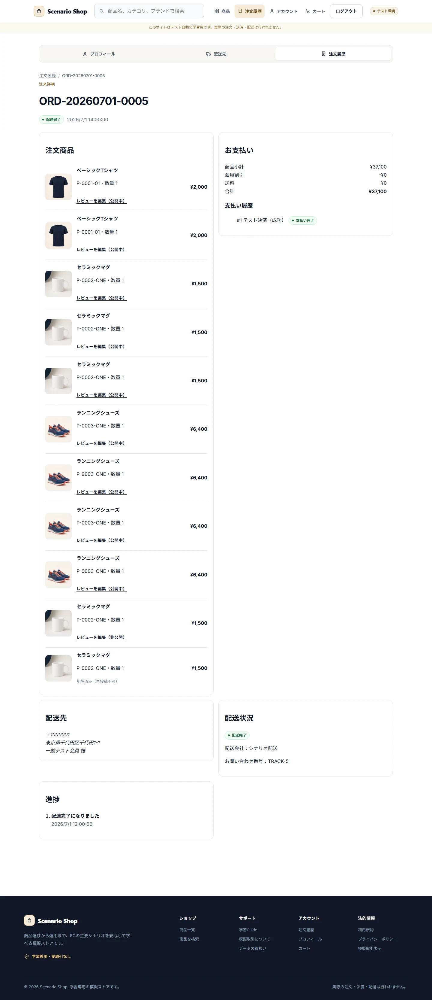
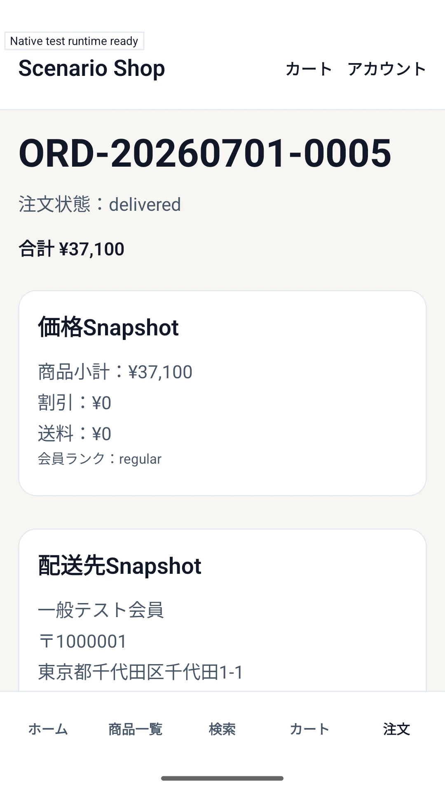
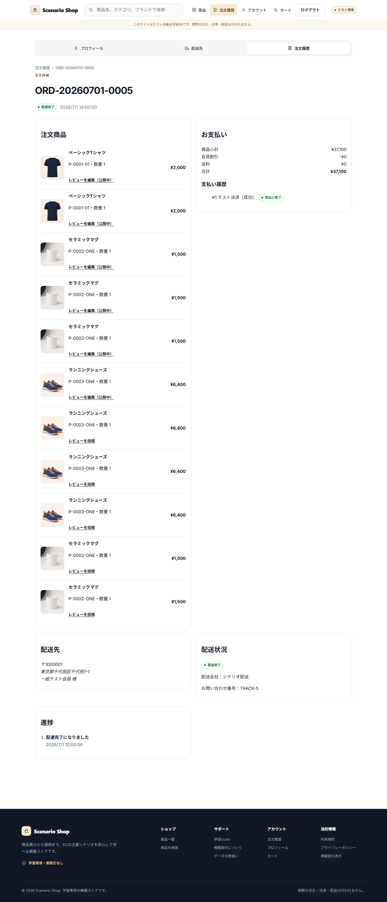

# Orders

## Purpose / Scope

OrderのSnapshot、Customer表示、Operator/Adminの準備・発送・配送完了、Order/Shipmentの状態整合を定義します。

## Business Rules

### BR-ORDER-001 — Orderは作成時点の購入情報をSnapshotする

商品、SKU、価格、Rank、配送先、画像、Order Item line numberを作成時点で保存し、後のProduct/User変更でOrder履歴を変えません。

### BR-ORDER-002 — OrderとShipmentは許可された順序で同一Transactionに更新する

paid → preparing → shipped → deliveredの順を守り、発送/配送完了ではOrderとShipmentを同一Transactionで更新します。

## UI / Behavior Contract

Customerは注文番号、合計、配送先概要、Payment、Shipment、Timeline、次のActionを確認できます。Operator/AdminはCustomer購入操作を持たず、管理対象Orderの許可された状態だけを進めます。

### SCREEN-ORDERS-LIST — Orders

Screen Catalog: [Screen Catalog](../screen-catalog.md)

#### Functions

- Customer自身のOrder番号、合計、Payment、Shipment、Timelineを一覧表示する。
- Empty、processing、failedを別のStatus表示として扱う。

#### Important UI States

| State slug | Type | Audience / Role | Condition / Scenario | Expected UI | Visual requirement | Required platforms | Visual detail | Related Oracle |
|---|---|---|---|---|---|---|---|---|
| `default` | baseline | `customer` | `regular-member` | 注文一覧とStatusを表示する。 | `required` | `web-desktop, android` | `-` | `BR-ORDER-001`, `AC-ORDER-001` |
| `empty` | empty | `customer` | `orders-empty` | 注文がないこととStorefront導線を表示する。 | `required` | `web-desktop` | `-` | `BR-ORDER-001`, `AC-ORDER-001` |

#### Visual References

##### `default`

###### Web Desktop

###### Android — Canonical Visual Reference

##### `empty`

###### Web Desktop

### SCREEN-ORDERS-DETAIL — Order Detail

Screen Catalog: [Screen Catalog](../screen-catalog.md)

#### Functions

- Order Snapshot、Payment、Shipment、Timeline、Review eligibilityを表示する。
- Customer本人のOrderだけを表示し、現在のProduct変更でSnapshotを変えない。

#### Important UI States

| State slug | Type | Audience / Role | Condition / Scenario | Expected UI | Visual requirement | Required platforms | Visual detail | Related Oracle |
|---|---|---|---|---|---|---|---|---|
| `default` | baseline | `customer` | `regular-member` | Order SnapshotとShipment状態を表示する。 | `required` | `web-desktop, android` | `-` | `BR-ORDER-001`, `AC-ORDER-001` |
| `reviewable` | domain | `customer` | `reviewable-orders` | Delivered itemのReview導線を表示する。 | `required` | `web-desktop` | `-` | `BR-ORDER-001`, `AC-ORDER-001` |

#### Visual References

##### `default`

###### Web Desktop

###### Android — Canonical Visual Reference

##### `reviewable`

###### Web Desktop

## Acceptance Criteria

### Criteria

#### AC-ORDER-001 — Order履歴をSnapshotとして表示する

Related BR: `BR-ORDER-001`

Product、Price、Rank、Addressを後から変更しても注文詳細のSnapshotとline orderが変わりません。

#### AC-ORDER-002 — Shipment遷移を飛び越さない

Related BR: `BR-ORDER-002`

paidから直接shippedへ進めず、Order/Shipmentがpreparing、shipped、deliveredの各段階で一致します。

## Executable Canonical Sources

- `src/application/use-cases/checkout-order-use-cases.ts`
- `src/application/use-cases/admin-operations-use-cases.ts`
- `src/domain/policies/state-transitions.ts`
- `src/seeds/default-dataset.ts`
- `app/orders/`, `app/admin/orders/`
