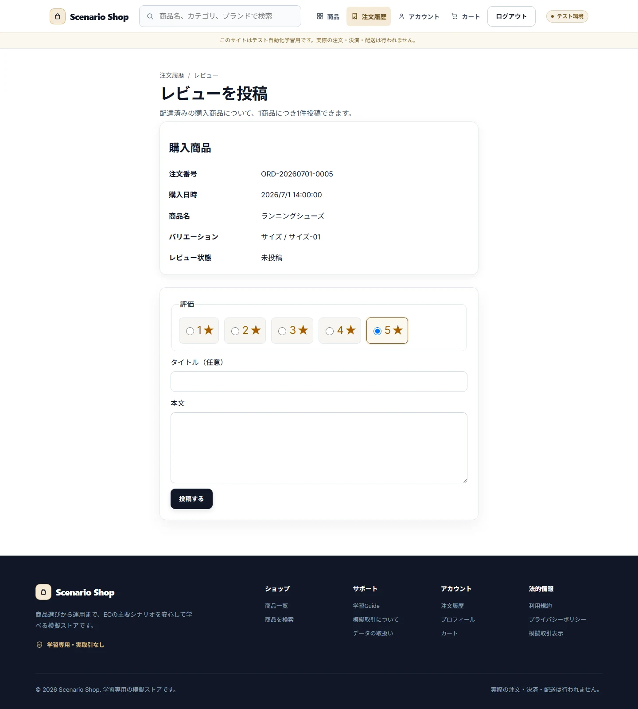
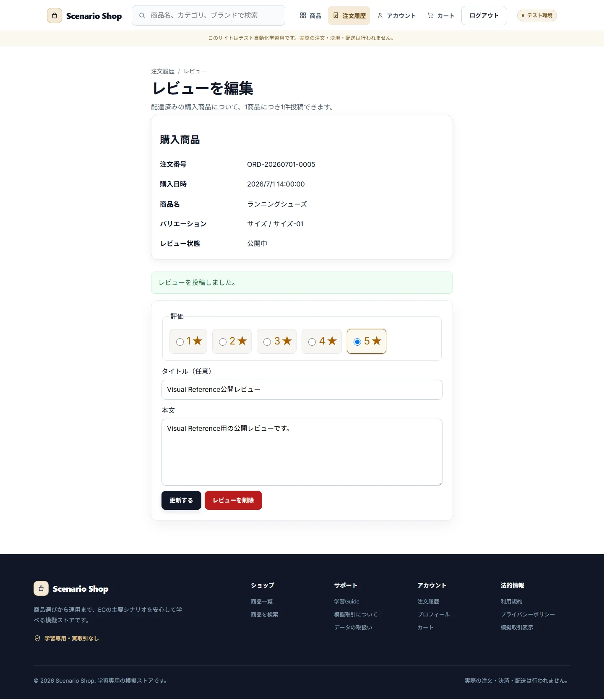
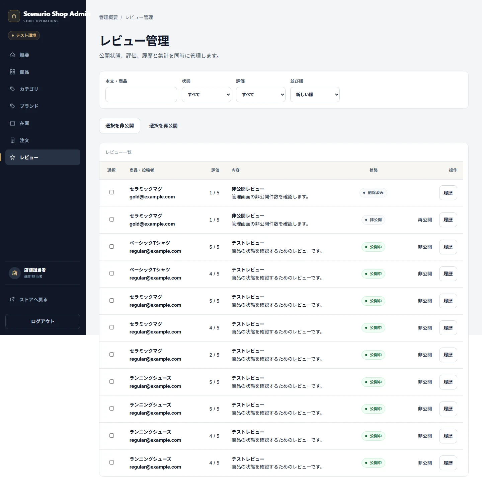
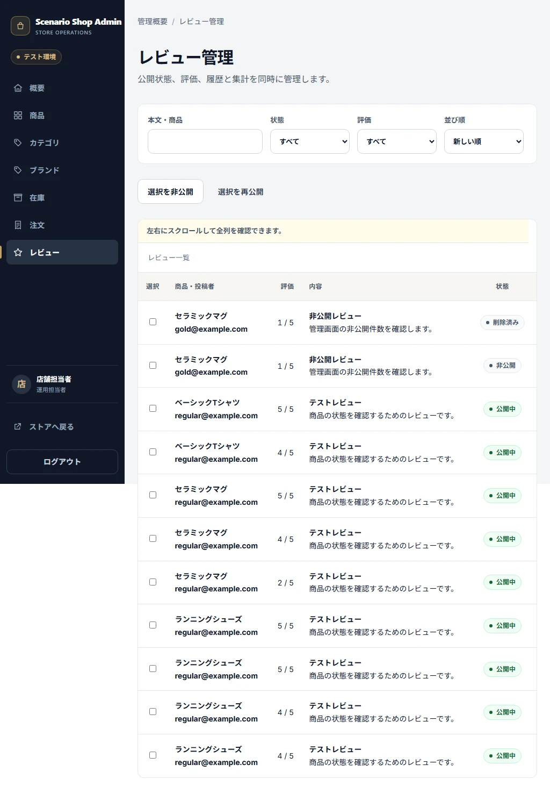

# Reviews

## Purpose / Scope

Delivered注文のCustomer Review eligibility、投稿・編集・削除、公開/非公開状態、Product Summaryを定義します。

## Business Rules

### BR-REVIEW-001 — Delivered注文の本人明細だけがReview対象になる

Customer本人のdelivered Order Itemに対して1件だけ作成でき、削除後も同じOrder Itemへ再投稿できません。

### BR-REVIEW-002 — Review状態とProduct Summaryを一貫して更新する

publishedだけを商品表示へ集計し、hiddenは再公開操作まで非表示、deletedは終端とします。編集は状態を自動変更しません。

## UI / Behavior Contract

Customerは本人Reviewの評価、Title、本文、Status、Versionを編集できます。Adminは公開/非公開を管理できます。削除済みを編集・再投稿できるUIを表示しません。

### SCREEN-REVIEWS-EDITOR — Review Editor

Screen Catalog: [Screen Catalog](../screen-catalog.md)

#### Functions

- Deliveredかつ本人のOrder Itemに対してReviewを作成・編集する。
- published、hidden、deletedを表示し、deletedを再投稿可能に見せない。

#### Important UI States

| State slug | Type | Audience / Role | Condition / Scenario | Expected UI | Visual requirement | Required platforms | Visual detail | Related Oracle |
|---|---|---|---|---|---|---|---|---|
| `default` | baseline | `customer` | `reviewable-orders` | Rating、Title、本文、保存Actionを表示する。 | `required` | `web-desktop, android` | `-` | `BR-REVIEW-001`, `AC-REVIEW-001` |
| `published` | domain | `customer` | `reviewable-orders` | 既存Reviewの編集状態を表示する。 | `required` | `web-desktop` | `-` | `BR-REVIEW-002`, `AC-REVIEW-002` |

#### Visual References

##### `default`

###### Web Desktop

##### `published`

###### Web Desktop

### SCREEN-ADMIN-REVIEWS — Admin Reviews

Screen Catalog: [Screen Catalog](../screen-catalog.md)

#### Functions

- Operator/AdminがReviewの公開状態と一括操作結果を確認する。
- Customer ReviewのSnapshotを壊さずに公開/非公開を操作する。

#### Important UI States

| State slug | Type | Audience / Role | Condition / Scenario | Expected UI | Visual requirement | Required platforms | Visual detail | Related Oracle |
|---|---|---|---|---|---|---|---|---|
| `default` | baseline | `operator, admin` | `default` | Review一覧と状態操作を表示する。 | `required` | `web-desktop, web-tablet` | `-` | `BR-REVIEW-002`, `AC-REVIEW-002` |

#### Visual References

##### `default`

###### Web Desktop

###### Web Tablet

## Acceptance Criteria

### Criteria

#### AC-REVIEW-001 — Review Eligibilityを制限する

Related BR: `BR-REVIEW-001`

未配達、他人、既存Review、削除済みの明細が投稿対象にならず、delivered本人明細だけが一度投稿できます。

#### AC-REVIEW-002 — 公開集計と状態遷移を分ける

Related BR: `BR-REVIEW-002`

published/hidden/deletedの表示、編集、Admin操作、Product Summaryの件数・平均・分布が一致します。

## Executable Canonical Sources

- `src/application/use-cases/review-user-use-cases.ts`
- `src/application/use-cases/customer-review-state.ts`
- `src/domain/policies/state-transitions.ts`
- `app/reviews/`, `app/admin/reviews.tsx`
