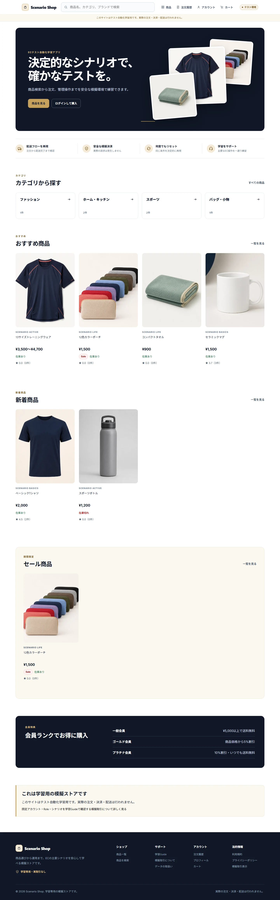
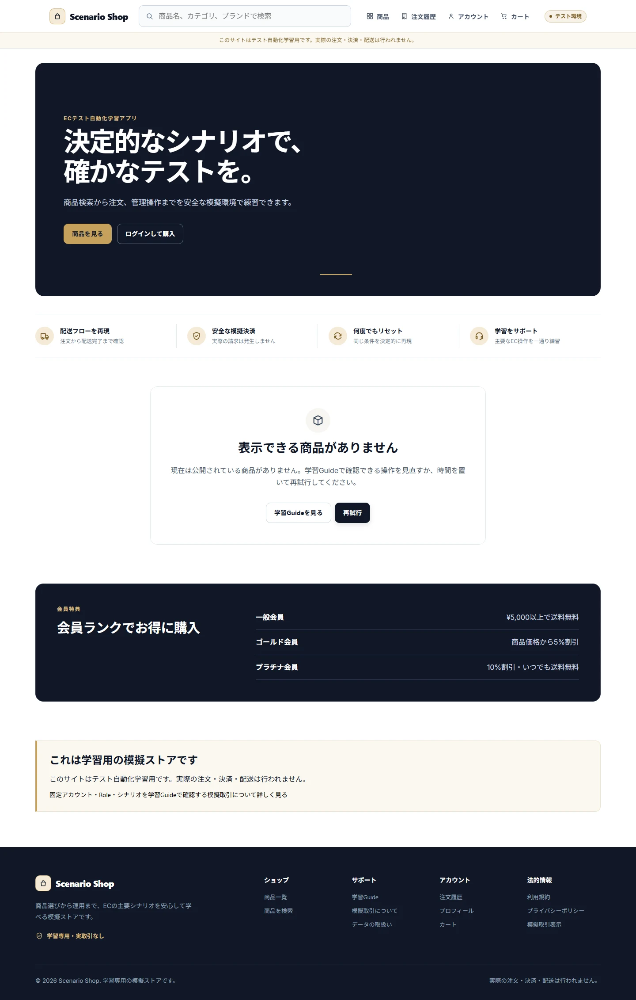
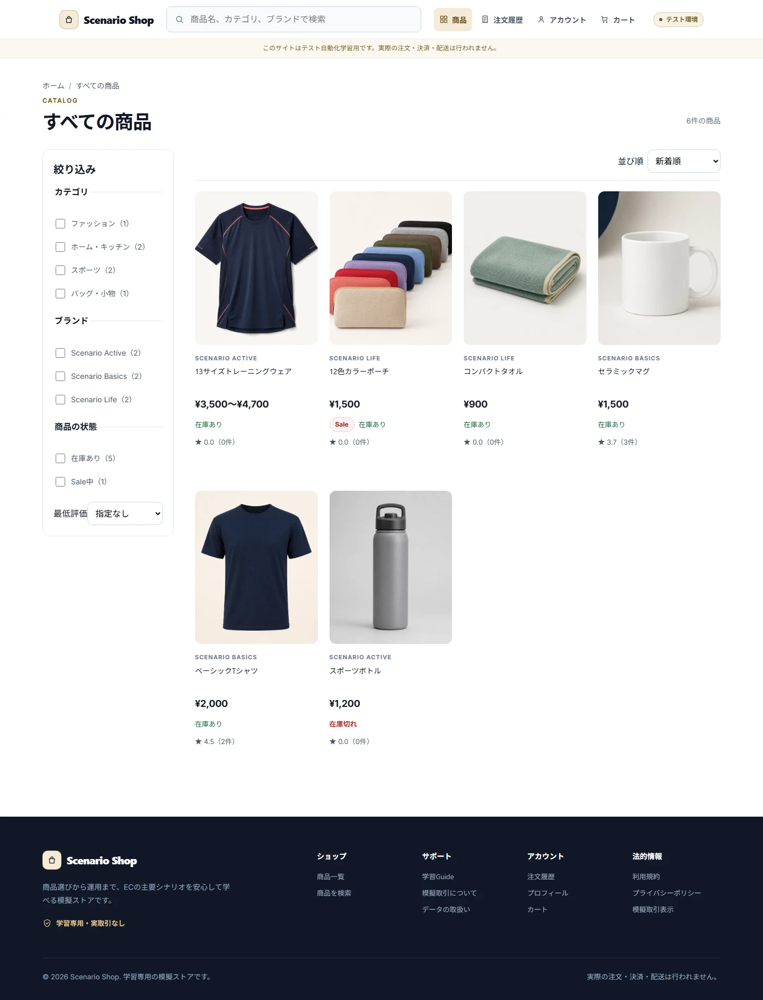
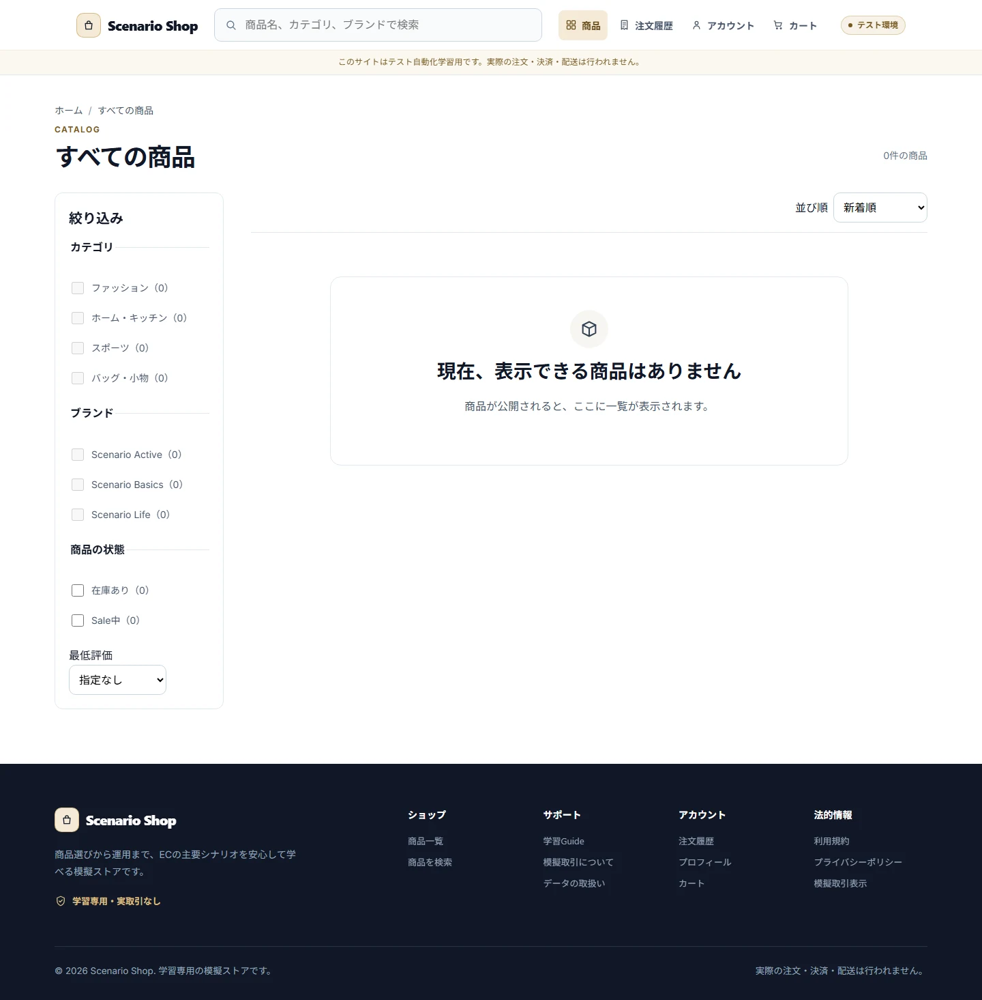
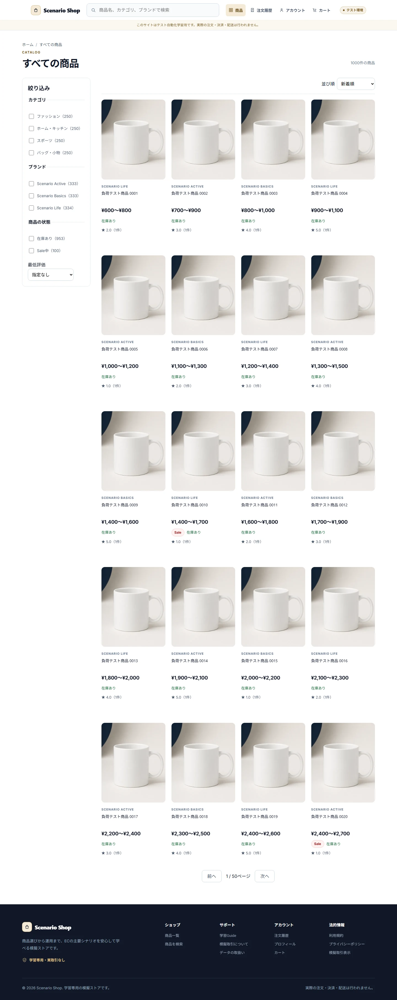
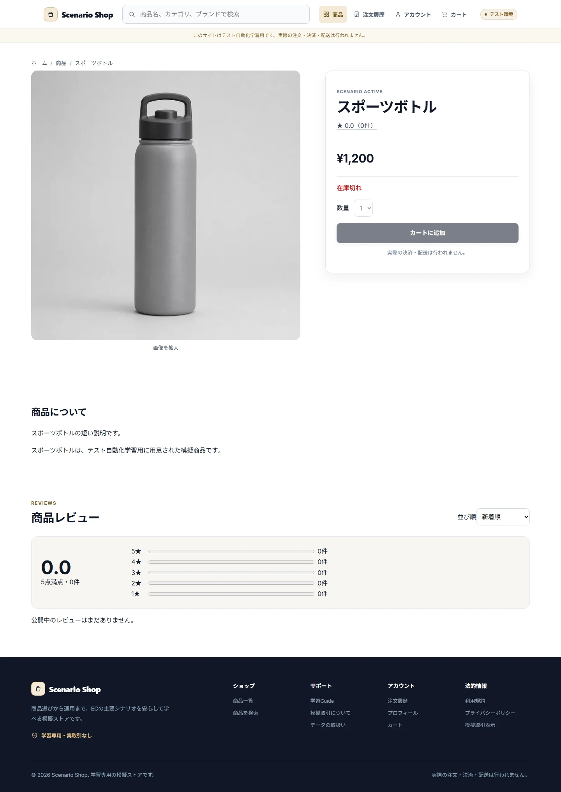
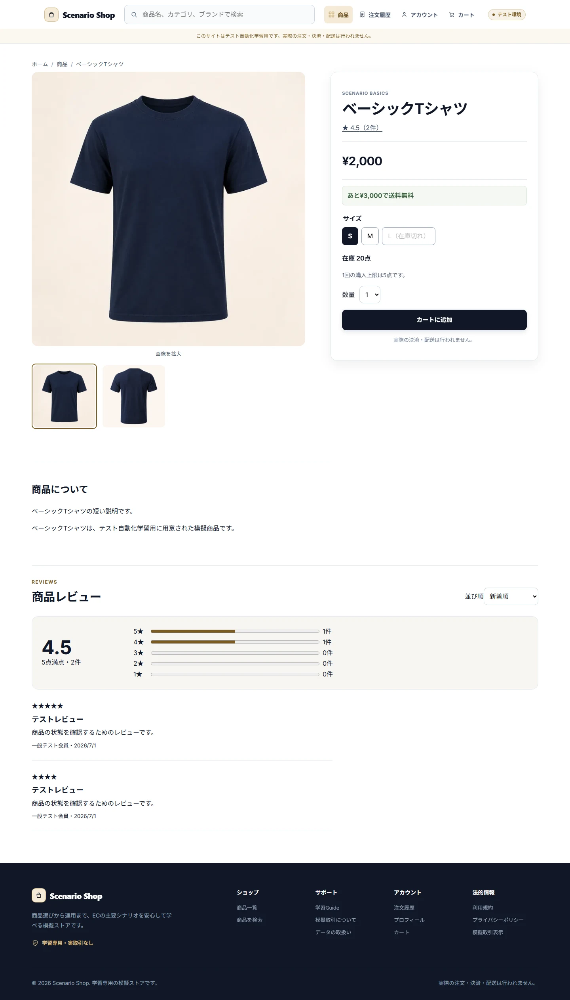
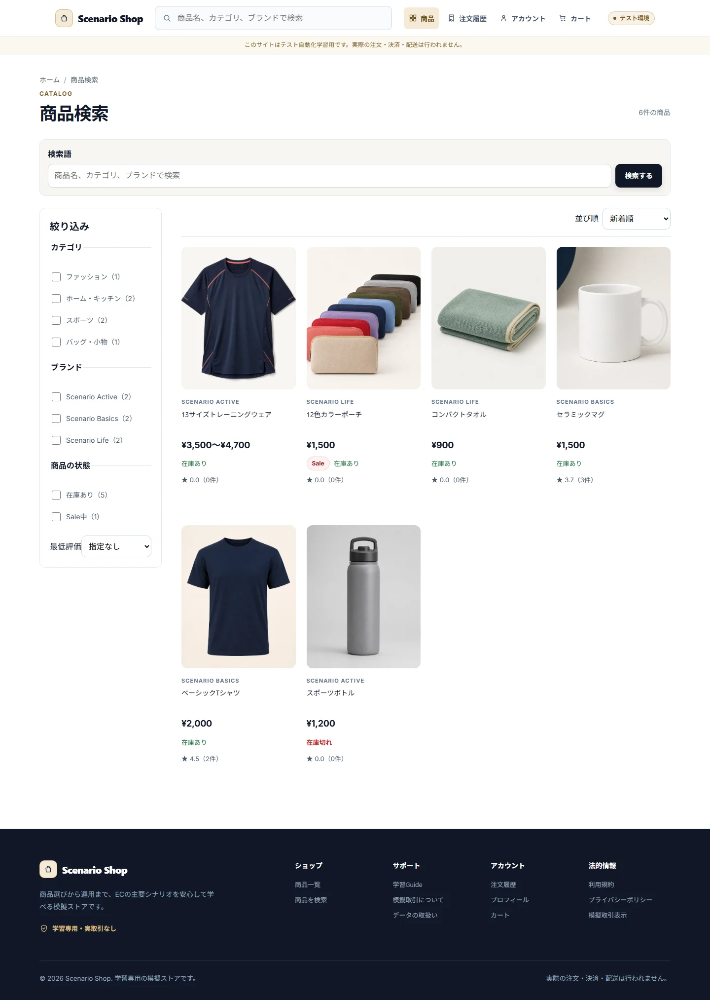
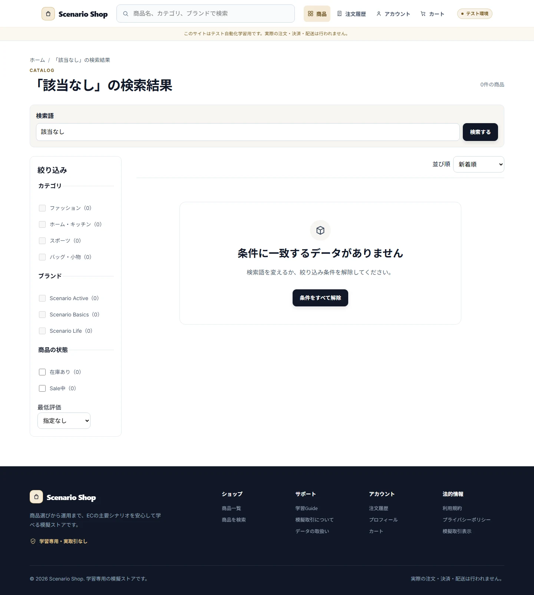
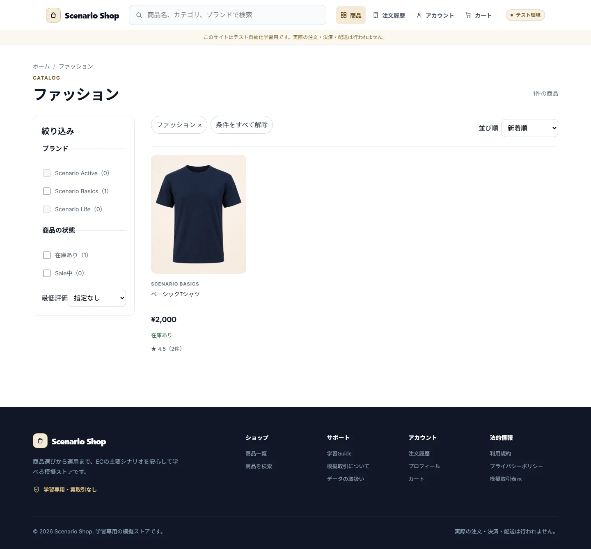

# Storefront

## Purpose / Scope

GuestとCustomerが公開商品を探索し、検索、Category/Brand、価格、Sale、在庫、評価、Variationを確認するWeb/Native Storefrontの共通挙動を定義します。Admin編集と購入確定は別Featureです。

## Business Rules

### BR-STOREFRONT-001 — Viewer条件を満たす公開商品だけを表示する

公開状態、Rank制限、Viewer種別を適用し、見えない商品を一覧、Home、詳細、Facetへ混ぜません。

### BR-STOREFRONT-002 — 検索とFacetは同じViewer条件で決定的に絞り込む

Keyword、Category、Brand、価格、在庫、Sale、最低評価を適用し、同一Facet内はOR、異なるFacet間はANDとしてtotal/pageを計算します。

### BR-STOREFRONT-003 — Variationと価格を現在時刻・Viewerに合わせて表示する

Sale期間、会員割引、在庫、購入上限を表示し、未選択または在庫切れVariationの追加操作を許可しません。

## UI / Behavior Contract

Homeは主要Category、新着、Sale、Rank案内を表示します。検索Suggestionは2文字以上で最大8件です。12件以下のVariationはButton群、13件以上はSelectとし、商品一覧の同順位はproductCodeで安定させます。

### SCREEN-STOREFRONT-HOME — Home

Screen Catalog: [Screen Catalog](../screen-catalog.md)

#### Functions

- 公開商品、主要カテゴリ、新着、Sale、Rank案内への入口を表示する。
- GuestとCustomerで利用可能な導線を既存のRole契約に従って表示する。

#### Important UI States

| State slug | Type | Audience / Role | Condition / Scenario | Expected UI | Visual requirement | Required platforms | Visual detail | Related Oracle |
|---|---|---|---|---|---|---|---|---|
| `default` | baseline | `guest, customer, operator, admin` | `default` | 公開商品と主要導線を表示する。 | `required` | `web-desktop, android` | `-` | `BR-STOREFRONT-001`, `AC-STOREFRONT-001` |
| `empty-catalog` | empty | `guest, customer` | `empty-catalog` | 公開商品がないことを一つのEmpty Stateで説明する。 | `required` | `web-desktop` | `-` | `BR-STOREFRONT-001`, `AC-STOREFRONT-001` |

#### Visual References

##### `default`

###### Web Desktop

##### `empty-catalog`

###### Web Desktop

### SCREEN-STOREFRONT-PRODUCT-LIST — Product List

Screen Catalog: [Screen Catalog](../screen-catalog.md)

#### Functions

- 公開条件を満たす商品を一覧、ページング、Filter、Sortで探索する。
- 商品カードへ商品詳細と購入導線を提供する。

#### Important UI States

| State slug | Type | Audience / Role | Condition / Scenario | Expected UI | Visual requirement | Required platforms | Visual detail | Related Oracle |
|---|---|---|---|---|---|---|---|---|
| `default` | baseline | `guest, customer, operator, admin` | `default` | 商品一覧とFacetを表示する。 | `required` | `web-desktop, android` | `-` | `BR-STOREFRONT-001`, `AC-STOREFRONT-002` |
| `empty` | empty | `guest, customer` | `empty-catalog` | 表示可能な商品がない理由と戻り導線を表示する。 | `required` | `web-desktop` | `-` | `BR-STOREFRONT-001`, `AC-STOREFRONT-001` |
| `many-products` | domain | `guest, customer` | `many-products` | 多数商品をページングできる。 | `required` | `web-desktop` | `-` | `BR-STOREFRONT-002`, `AC-STOREFRONT-002` |

#### Visual References

##### `default`

###### Web Desktop

##### `empty`

###### Web Desktop

##### `many-products`

###### Web Desktop

### SCREEN-STOREFRONT-PRODUCT-DETAIL — Product Detail

Screen Catalog: [Screen Catalog](../screen-catalog.md)

#### Functions

- 商品画像、価格、Sale、Review Summary、Variation、在庫、購入上限を表示する。
- 選択可能なVariationだけをCart追加へ進める。

#### Important UI States

| State slug | Type | Audience / Role | Condition / Scenario | Expected UI | Visual requirement | Required platforms | Visual detail | Related Oracle |
|---|---|---|---|---|---|---|---|---|
| `default` | baseline | `guest, customer, operator, admin` | `default` | 商品情報とVariation選択を表示する。 | `required` | `web-desktop, android` | `-` | `BR-STOREFRONT-003`, `AC-STOREFRONT-003` |
| `out-of-stock` | domain | `guest, customer` | `out-of-stock` | 在庫切れと追加不可理由を表示する。 | `required` | `web-desktop` | `-` | `BR-STOREFRONT-003`, `AC-STOREFRONT-003` |
| `low-stock` | domain | `guest, customer` | `low-stock` | 残り数量と購入上限を表示する。 | `required` | `web-desktop` | `-` | `BR-STOREFRONT-003`, `AC-STOREFRONT-003` |

#### Visual References

##### `default`

###### Web Desktop

##### `out-of-stock`

###### Web Desktop

##### `low-stock`

###### Web Desktop

### SCREEN-STOREFRONT-SEARCH — Search

Screen Catalog: [Screen Catalog](../screen-catalog.md)

#### Functions

- 商品名、Code、Suggestion、Filterで公開商品を検索する。
- 結果がない場合に検索条件を見直す導線を表示する。

#### Important UI States

| State slug | Type | Audience / Role | Condition / Scenario | Expected UI | Visual requirement | Required platforms | Visual detail | Related Oracle |
|---|---|---|---|---|---|---|---|---|
| `default` | baseline | `guest, customer, operator, admin` | `default` | 検索入力と結果を表示する。 | `required` | `web-desktop, android` | `-` | `BR-STOREFRONT-002`, `AC-STOREFRONT-002` |
| `no-results` | empty | `guest, customer` | `search-empty` | 条件に一致しないことを表示する。 | `required` | `web-desktop` | `-` | `BR-STOREFRONT-002`, `AC-STOREFRONT-002` |

#### Visual References

##### `default`

###### Web Desktop

##### `no-results`

###### Web Desktop

### SCREEN-STOREFRONT-CATEGORY — Category

Screen Catalog: [Screen Catalog](../screen-catalog.md)

#### Functions

- Categoryに属する公開商品を一覧表示する。
- Viewer条件に合わない商品を表示結果へ混ぜない。

#### Important UI States

| State slug | Type | Audience / Role | Condition / Scenario | Expected UI | Visual requirement | Required platforms | Visual detail | Related Oracle |
|---|---|---|---|---|---|---|---|---|
| `default` | baseline | `guest, customer, operator, admin` | `default` | Category名と対象商品を表示する。 | `required` | `web-desktop, android` | `-` | `BR-STOREFRONT-001`, `AC-STOREFRONT-001` |

#### Visual References

##### `default`

###### Web Desktop

## Acceptance Criteria

### Criteria

#### AC-STOREFRONT-001 — 公開条件を満たさない商品を除外する

Related BR: `BR-STOREFRONT-001`

Guest、Customer、Rank制限の異なるViewerで、一覧・Home・詳細の表示結果がNormative条件と一致します。

#### AC-STOREFRONT-002 — FacetとPaginationが一貫する

Related BR: `BR-STOREFRONT-002`

Viewer条件と選択Filterを適用したtotal、page、Facet件数、安定Sortが一致します。

#### AC-STOREFRONT-003 — Variationと価格のBoundaryを表示する

Related BR: `BR-STOREFRONT-003`

Sale期間外、在庫0、未選択Variation、会員Rank別価格を、操作可能性と理由表示を含めて確認できます。

## Executable Canonical Sources

- `src/application/use-cases/catalog-use-cases.ts`
- `src/domain/policies/permissions.ts`
- `src/domain/services/pricing.ts`
- `src/seeds/metadata.ts`
- `app/products/`, `app/search.tsx`, `app/categories/`
