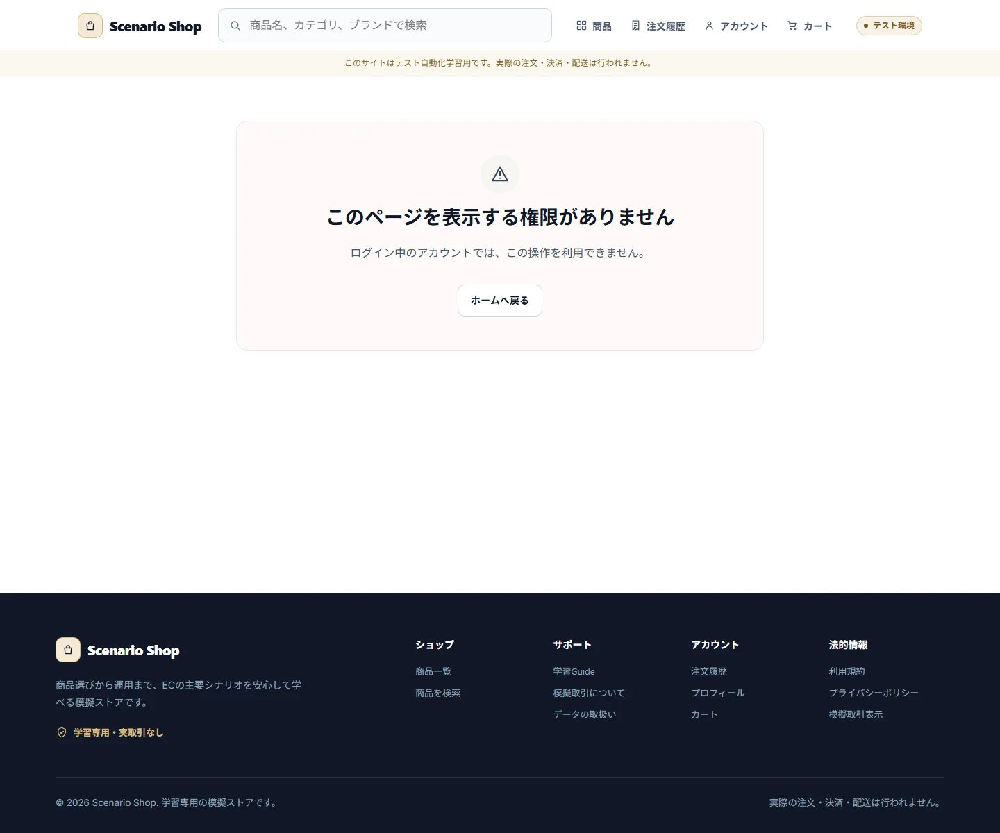

# Roles and Permissions

## Roles

| Actor | Storefront | Cart | Checkout | Customer data | Store management | User management |
|---|---:|---:|---:|---:|---:|---:|
| guest | read | yes | no | no | no | no |
| customer(active) | read | yes | yes | own only | no | no |
| customer(suspended/withdrawn) | login denied | no session | no | no | no | no |
| operator(active) | guest-equivalent read | no | no | no | yes | no |
| admin(active) | guest-equivalent read | no | no | no | yes | yes |

## Customer Rank

`regular`、`gold`、`platinum`の順に権限水準を持ちます。Rank制限商品は同等以上のCustomerだけが見えます。価格割引と送料条件は現在のRankから単価ごとに計算します。具体的なRank値は `src/domain/policies/permissions.ts` と価格計算Use Caseを正本とします。

## Authorization

AuthorizationはUI表示だけでなくApplication Use Caseで強制します。Customerは自分のAccount、Address、Order、Reviewだけを操作できます。Operator/AdminはStore管理を行えますが、Customer購入導線を利用できません。AdminだけがUser管理を行います。

## Account Status

`active`だけがCustomer LoginとCheckoutを許可されます。`suspended`と`withdrawn`はLoginを拒否します。管理操作で扱うAccount遷移は `active ↔ suspended` に限り、`withdrawn`は固定Seedの読取専用状態です。

## Canonical Sources

Role/Statusの型は `src/domain/contracts/entities.ts`、認可Policyは `src/domain/policies/permissions.ts`、SessionとRoute Guardは `src/application/` および `src/presentation/`、固定アカウントは `src/seeds/default-dataset.ts` を参照してください。

## Screen Contracts

### SCREEN-BOUNDARY-FORBIDDEN — Forbidden

Screen Catalog: [Screen Catalog](./screen-catalog.md)

#### Functions

- RoleまたはPermissionにより利用できないRouteであることを説明する。
- 利用者が安全なStorefrontまたは許可された入口へ戻れるActionを表示する。

#### Important UI States

| State slug | Type | Audience / Role | Condition / Scenario | Expected UI | Visual requirement | Required platforms | Visual detail | Related Oracle |
|---|---|---|---|---|---|---|---|---|
| `default` | baseline | `guest, customer, operator, admin` | `default` | 権限不足の説明と安全な戻り先を表示する。 | `required` | `web-desktop, android` | `-` | [Roles and Permissions](./roles-and-permissions.md#authorization), [UI and UX Contract](./ui-ux-contract.md#boundary-ux) |

#### Visual References

##### `default`

###### Web Desktop

