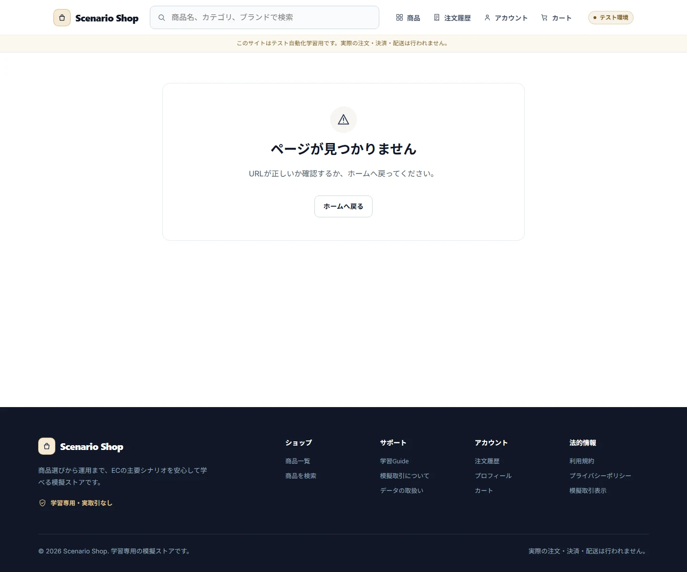
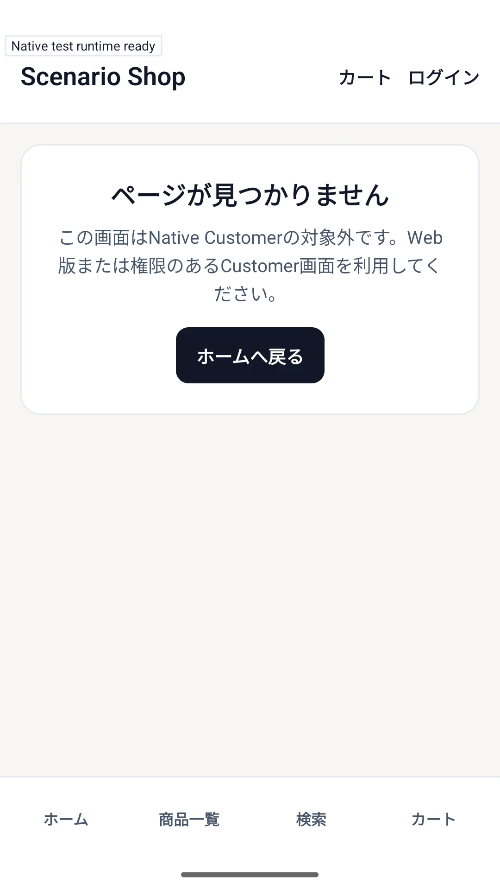

# UI and UX Contract

## Responsive Behavior

Mobileは767px以下、Tabletは768〜1023px、Desktopは1024px以上を基本境界とします。Storefront/Customerは390×844を標準Mobile、320×700を追加境界として扱います。管理画面は1024px未満で管理操作を提供せず、Warningまたは安全な入口を表示します。

## Visual Language

画面はOff White、Dark Navy、限定Goldを基調にし、8px Grid、44px以上のTouch Target、Border中心のCardを使います。色、Typography、Spacing、Radiusは `src/presentation/design/tokens.ts` と `src/presentation/styles/global.css` を正本とし、仕様は意味と利用目的だけを定義します。

## Accessibility

主要FlowはKeyboardで完了できます。SearchはCombobox、RatingはRadio Group、Error SummaryはHeading/Link、確認はDialog、Filterは操作可能なSheetとして実装します。Errorを色だけで伝えず、Label/Role/Textを併用します。Route遷移後の主要HeadingにはFocusを移します。

## Boundary UX

Loading、Empty、Error、Conflict、Not Foundを同じ表示へ潰しません。未選択Variation、在庫切れ、価格変更、Login拒否、Checkout Version不一致、Payment失敗、権限拒否には利用者が次に取れるActionを表示します。内部Enum、Repository Version、Actor ID、Gateway KeyをCustomer UIへ露出しません。

## Canonical Sources

具体的なLabel、Test ID、Route、Token、Component構造は `src/presentation/`、`app/`、`src/presentation/design/tokens.ts`、`docs/05_ui/` を参照してください。既存TestはRegression Evidenceであり、Normative Oracleではありません。

## Screen Contracts

### SCREEN-BOUNDARY-NOT-FOUND — Not Found

Screen Catalog: [Screen Catalog](./screen-catalog.md)

#### Functions

- 存在しないRouteを明示し、利用者がStorefrontへ戻れるActionを表示する。
- Framework internal entryではなく、ユーザーが観測できるBoundary surfaceとして扱う。

#### Important UI States

| State slug | Type | Audience / Role | Condition / Scenario | Expected UI | Visual requirement | Required platforms | Visual detail | Related Oracle |
|---|---|---|---|---|---|---|---|---|
| `default` | baseline | `all` | `missing-route` | Page Not Foundと戻り先を表示する。 | `required` | `web-desktop, android` | `-` | [UI and UX Contract](./ui-ux-contract.md#boundary-ux), [State and Scenarios](./state-and-scenarios.md#error-and-boundary-states) |

#### Visual References

##### `default`

###### Web Desktop

###### Android — Canonical Visual Reference

